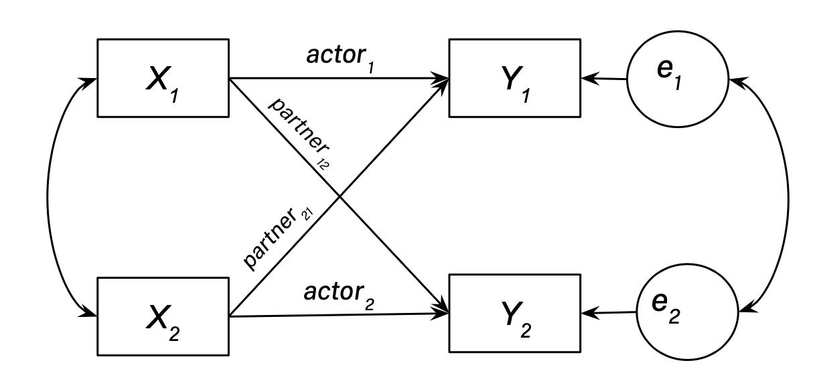

```{r Setup, include=FALSE}
knitr::opts_chunk$set(echo = TRUE, error = FALSE)
options(yaml.eval.expr = TRUE)
```

# README:

## Description

A great deal of statistical methods and analyses focus on analyzing social processes at an individual level. Using dyadic methods (statistical analyses of pairs), we can examine how individuals influence one another 1:1 and can pinpoint how each person in an interaction influences the other. These methods have been utilized in the past to examine interpersonal linkage and influence at multiple levels of analysis (e.g., physiological, self-report, behavioral).

In this workshop, we will walk through an introduction to dyadic analysis and visualization in R. Statistical concepts (e.g., Actor-Partner Interdependence Models) will be briefly introduced, but the workshop focus will be on application of these methods rather than their statistical underpinnings. Recommended readings for further statistical depth will be provided. R, RStudio, and familiarity with R are pre-requisites for this workshop. This workshop will cover a basic introduction to dyadic data analysis, both Multilevel Modeling for dyads and Actor Partner Interdependence Modeling, and their visualization, in R.

## Prerequisites

This workshop requires that users:

1.  have the R programming language downloaded, which can be accessed here:(<https://archive.linux.duke.edu/cran/>)
2.  have the R Studio user interface downloaded, which can be accessed here:(<https://www.rstudio.com/products/rstudio/download/#download>)
3.  have a proficiency with the R programming language (see resources below):

-   installing packages and loading libraries
-   [data structures and objects in R](https://swcarpentry.github.io/r-novice-inflammation/13-supp-data-structures/)\
-   have a proficiency with the R programming language:
    -   [Python and R for Data Science](https://www.anotherbookondatascience.com)
    -   [R for Data Science](https://r4ds.had.co.nz)
    -   [Introduction to Data Exploration and Analysis with R](https://bookdown.org/mikemahoney218/IDEAR/)
    -   [lavaan documentation](https://lavaan.ugent.be)
    -   [lme4 documentation](https://github.com/lme4/lme4/)
-   have a basic understanding of multivariate statistical analysis (e.g., multilevel modeling, structural equation models)
-   have a basic familiarity with plotting data in R; previous primers can be accessed here: (<https://github.com/TU-Coding-Outreach-Group/cog_summer_workshops_2021/tree/main/data-visualization-in-r>)
-   have an interest in interpersonal processes of some kind (including but not limited to parent-child, couple, friend, clinical, boss-employee relationships)

## What we won't cover

It is worth noting that this workshop will cover basics and application of data wrangling, a few analytic techniques, and visualization for dyadic data in R. Given the breadth of the workshop, we will not go into a great level of detail on the statistical foundations of each model described. For example, while we will apply Actor-Partner Interdependence Models and Multilevel Models to dyadic data and discuss some nuances of each approach, we will not dive very deeply into the statistical foundations of these models. Likewise, we will cover the most basic applications of each model and will not cover more advanced topics such as examination of direct/indirect effects or more complex designs (e.g., intensive longitudinal modeling, Bayesian methods). For interested workshop participants, I have included a few recommended resources that go into greater depth regarding the underpinnings of dyadic analyses, more advanced applications of each method, and their uses in psychological research in "References and recommended resources" below.

## Set-up (to-do before the workshop)

1.  Download the R-markdown script from Github

# Workshop Objectives & Introduction

<iframe width="560" height="315" src="https://youtu.be/rmz5eD7Wgng" frameborder="0" allowfullscreen>

</iframe>

# Workshop Setup

I'm first going to load the couple of packages that we will need for this workshop. Running the code chunk below will load the desired packages if you have already installed them, and automatically install any needed packages if you have not yet done so.

This workshop was generated with R version 4.3.0 (R Core Team 2023) and the following R packages: here v. 1.0.1 (Müller 2020), knitr v. 1.43 (Xie 2014, 2015, 2023), lavaan v. 0.6.15 (Rosseel 2012), mice v. 3.16.0 (van Buuren and Groothuis-Oudshoorn 2011), modelsummary v. 1.4.1 (Arel-Bundock 2022), rmarkdown v. 2.22 (Xie, Allaire, and Grolemund 2018; Xie, Dervieux, and Riederer 2020; Allaire et al. 2023), semPlot v. 1.1.6 (Epskamp 2022), tidyverse v. 2.0.0 (Wickham et al. 2019).

```{r Packages, message=F, warning=F}
cog_packages <- c("tidyverse", "data.table", "modelsummary", "skimr", "psych", "lme4", "lmerTest", "lavaan", "semPlot", "grateful", "reactable", "mice", "finalfit", "effects", "lavaanPlot", "ppcor", "nlme")

packages <- rownames(installed.packages())
p_to_install <- cog_packages[!(cog_packages %in% packages)]

if(length(p_to_install) > 0){
  install.packages(p_to_install)
}

lapply(cog_packages, library, character.only = TRUE)

rm(cog_packages, p_to_install) #clean environment
#cite_packages(out.dir = ".") #generate citation list for packages
```

See the slides included with this workshop and outlined in the video above for a basic introduction to important concepts in dyadic analysis (for details, see Kenny, Kashy, & Cook, 2006).

## About the data

For this workshop, we will be reading in a dyadic dataset that comes from an article conducted by called, "Gender differences in mate selection: evidence from a speed dating experiment" [(Fisman, Iyengar, Kamenica, & Simonson, 2006)](http://www.stat.columbia.edu/~gelman/stuff_for_blog/sheena.pdf). This data is also featured for use in problem sets in a textbook you might be familiar with, *Data Analysis Using Regression and Multilevel/Hierarchical Models* [(Gelman & Hill, 2006)](http://www.stat.columbia.edu/~gelman/arm/).

The data comes from a speed-dating study conducted by Dr. Ray Fisman & Dr. Sheena Iyengar at Columbia Business School (Fishman, Iyengar, Kamenica, & Simonson, 2006). In the study, participants attended speed-dating events and had four-minute speed dates with every other participant of the opposite gender (self-identified) attending the event (participants were all interested in dating the opposite gender) in randomized order. After each "date," participants indicated whether they would like to see their partner again and rated their partner on attractiveness, sincerity, intelligence, fun, ambition, and shared interests. The dataset also contains information on participants' perceptions of themselves and the desirability of these six features, their goals for dating, and some demographics.

Across waves of speed-dating data collection, we are going to look at perceptions between participants and partners who are sharing a first date. This means that our analyses will look at unique dyads (with unique participants and partners), making the data appropriate for analyses built for standard dyadic designs. It's worth noting that some of these methods can be modified for use with round-robin data too (i.e., to account for repetition of individuals in multiple dyads), but Social Relations Models may be a better fit for round-robin data depending on the research question.

# Step 1: Import raw data

We're first going to import and examine the raw data described above from the website for the Gelman & Hill (2006) textbook. The codebook for the data is also available at the same source (<http://www.stat.columbia.edu/~gelman/arm/examples/>), but I will briefly outline the variables of interest below. We are interested in looking at dyads where both members are having their first interaction. We will create a unique dyad identifier for pairs ("dyad_id") and select data where both people within a dyad are having their first interaction of the round so we can look at first dates.

```{r Import}
## import raw speed-dating data from Dr. Gelman's site
dyad_df_raw <- as.data.frame(fread("http://www.stat.columbia.edu/~gelman/arm/examples/speed.dating/Speed%20Dating%20Data.csv"))

## create dyad id column
dyad_df_raw <- dyad_df_raw %>%
  group_by(pid, iid) %>%
  mutate(dyad_id = paste0(min(pid, iid), "_", max(pid, iid))) %>%
  ungroup() %>%
  mutate(dyad_id = match(dyad_id, unique(dyad_id)) + 100 %>% as.vector) %>%
  ungroup()

## select dyads who are sharing a first date
dyad_df <- dyad_df %>%
  subset(order == 1) %>%
  group_by(dyad_id) %>%
  filter(n() == 2) %>%
  ungroup()

skim(dyad_df)
head(dyad_df, n = 20) #examine to 20 rows of data
```

The variables we are interested in in for the purposes of analyses are as follows. See the Speed Dating codebook (located at the same link as the data) for more details:

-   iid: participant unique ID
-   pid: partner's unique ID
-   dyad_id: we created this above, it is a unique identifier for each dyad
-   wave and order: the wave of data collection where partners met and the order in which they met their partners
-   gender: participant's self-identified gender (0 = F, 1 = M)
-   age: participant's age
-   exphappy: participant's own expected happiness with their dates (1 = least, 10 = most)
-   int_corr: the correlation between the participant and their partner's interests indicated in an intake survey
-   order: the order of the date wherein a participant and partner met
-   like: rating of liking partner (1 = least, 10 = most)

partners' ratings of participants (1 = least, 10 = most)

-   attr_o: attractiveness (other-rated)
-   sinc_o: sincerity (other-rated)
-   fun_o: fun (other-rated)
-   intel_o: intelligence (other-rated)
-   amb_o: ambition (other-rated)
-   shar_o: shared interests (other-rated)

participants' ratings of partners (1 = least, 10 = most)

-   attr: attractiveness
-   sinc: sincerity
-   fun: fun
-   intel: intelligence
-   amb: ambition
-   shar: shared interests

We will also compute a couple of new variables below using the raw data:

-   like_o: partner's rating of liking a participant (1 = least, 10 = most)
-   attr_diff_abs: absolute difference between dyads' perceptions of one another's' attractiveness, where higher scores indicate more difference and lower scores indicate more similarity in perceived attractiveness between partners
-   sinc_diff_abs: absolute difference between dyads' perceptions of one another's' sincerity (higher scores = more different perceived sincerity, lower scores = more similarity)
-   amb_diff_abs: absolute difference between dyads' perceptions of one another's' ambition (higher scores = more different perceived ambition, lower scores = more similarity)
-   intel_diff_abs: absolute difference between dyads' perceptions of one another's' intelligence (higher scores = more different perceived intelligence, lower scores = more similarity)
-   shar_diff_abs: absolute difference between dyads' perceptions of one another's' shared interests (higher scores = more different perceived shared interests, lower scores = more similarity)
-   amb_diff_abs: absolute difference between dyads' perceptions of one another's' ambition (higher scores = more different perceived ambition, lower scores = more similarity)

Using this first-date data from the speed dating dataset, we can run many different analyses. We'll discuss dyadic multilevel models and various ways of estimating Actor-Partner Interdependence Models.

# Step 2: Data organization and wrangling

Next, we'll select just the variables we are interested in. Without getting too into the weeds of multiple imputation, we're also going to impute missing values here to simplify analyses later on (for details, see Enders, 2017; Enders, 2022; van Buuren, 2011). You can also skip imputation and exclude missing data, since it's quite a low percentage of the overall data, but that may complicate analyses if some dyads are missing observations. Lastly, we'll z-standardize variables of interest so that they are on the same scale.

```{r Wrangle}
## select variables we will need for analysis 
dyad_df <- dyad_df %>% dplyr::select(c('iid', 'pid', 'dyad_id', 'gender', 'age', 
                                       'exphappy', 'int_corr', 'wave', 'like', 
                                       'attr_o', 'sinc_o', 'fun_o', 'intel_o', 'amb_o', 'shar_o',#partner ratings of self
                                       'attr', 'sinc', 'fun', 'intel', 'amb', 'shar' #self ratings of partner
))

## examine missing data and perform multiple imputation
dyad_df %>%
  ff_glimpse()

dyad_df_imp <- mice(dyad_df, m = 5, maxit = 10, method = 'pmm', seed = 500) #impute

dyad_df_imp$method #check imputation performance - ensure method is pmm for numeric vars
mice::densityplot(dyad_df_imp) #check imputation performance - distributions of imputed vs. observed data

dyad_df_new <- complete(dyad_df_imp) #combine multiple imputations into 1 dataset

dyad_df_new %>%
  ff_glimpse() #check that we have no more missing vars

## compute new variables and update dataframe for analyses

# add a partner liking column
dyad_df_new <- dyad_df_new %>%
  group_by(dyad_id) %>%
  mutate(like_o = like[iid != pid] %>% as.vector) %>%
  ungroup()

# add absolute difference in ratings variables
dyad_df_new <- dyad_df_new %>%
  group_by(dyad_id) %>%
  mutate(attr_diff_abs = abs(attr - attr_o) %>% as.vector,
         intel_diff_abs = abs(intel - intel_o) %>% as.vector,
         sinc_diff_abs = abs(sinc - sinc_o) %>% as.vector,
         amb_diff_abs = abs(amb - amb_o) %>% as.vector,
         fun_diff_abs = abs(fun - fun_o) %>% as.vector,
         shar_diff_abs = abs(shar - shar_o) %>% as.vector
         ) %>%
  ungroup()
modelsummary::datasummary_skim(dyad_df)
reactable(dyad_df_new)

# make sure our columns are in the correct format for steps coming up

str(dyad_df_new) #check current format

factor_vars <- c('iid', 'pid', 'dyad_id', 'gender') #save vars we want as factors
numeric_vars <- c('age', 'exphappy', 'int_corr', 'wave', 'like', 'attr_o', 'sinc_o', 'fun_o', 'intel_o', 'amb_o', 'shar_o', 'attr', 'sinc', 'fun', 'intel', 'amb', 'shar', 'attr_diff_abs', 'shar_diff_abs', 'amb_diff_abs', 'intel_diff_abs', 'fun_diff_abs', 'sinc_diff_abs') #save vars we want as numeric

dyad_df_new[, factor_vars] <- lapply(dyad_df_new[, factor_vars], as.factor) #factor_vars to factor
dyad_df_new[, numeric_vars] <- lapply(dyad_df_new[, numeric_vars], as.numeric) #numeric_vars to numeric

str(dyad_df_new) #check updated format

# standardize vars so they're all on the same scale
no_standardize <- c('iid', 'pid', 'dyad_id', 'gender', 'age', 'wave', 'int_corr') #int_corr correlation values are pre-standardized.
dyad_df_new <- dyad_df_new %>% mutate(across(-one_of(no_standardize), ~ as.vector(scale(.)), .names = "{.col}_z"))

reactable(dyad_df_new) #looks good! we are ready for our first analysis.
```

Now that we have the data organized, we can get into some analysis. The data structure we have is pairwise, where each row contains participants' ratings of partners (e.g., "attr", "intel", "amb") as well as partners' ratings of participants themselves (e.g., "attr_o", "intel_o", "amb_o"). Linked here are other tutorials on more advanced restructuring (see [this tutorial by Ethan Young](https://www.ethan-young.com/code/restructuring-dyadic-data/) and [this tutorial by David Kenny](http://davidakenny.net/DyadR/RDDD.htm)) with dyadic data, which usually comes either in pairwise, dyad, or individual format and will have to be restructured depending on the analysis you want to run. We are currently working with pairwise data, and will restructure and examine data into dyad format for the APIM analysis in SEM (below).

# Step 3: Analysis

## Multilevel Model

We can use multilevel models with dyadic data when we have between-dyad independent variables, which you'll remember occur when the independent variable is the same between both people in each dyad (for example, relationship length). If independent variables vary between-dyad, we would be better off using APIM (below).

Since the data are dyadic, we have to ensure that non-independence is accounted for by correlating the errors of the people in the dyad and treating dyad members as indistinguishable. We'll first estimate a multilevel model via estimation in Generalized Least Squares through REML in the "nlme" R package ([see another example here from Garcia & Kenny, 2018](https://randilgarcia.github.io/week-dyad-workshop/MLM.html)). We'll also estimate the same model through Maximum Likelihood estimation in the "lme4" R package, which should produce the same results.

### A. Example

Is rating of liking ("like") predicted by gender ("gender") and shared interests ("int_corr")?

As an example, we will test whether personal liking of one's partner (like) is predicted by their self-identified gender (gender) and correlation of shared interests between the two dyad members (int_corr). We might expect that liking will be positively related to correlated interests. We'll use the standardized versions of all variables calculated above to ensure that they're on the same scale and facilitate interpretation of results. Note that the gls() command will give us z-test results as its test statistics, which is why the tests do not have degrees of freedom listed.

```{r MLM Example Model}
mlmA <- gls(like_z ~ gender + int_corr,
            correlation=corCompSymm (form=~1|dyad_id), 
            data=dyad_df_new)
summary(mlmA)
confint(mlmA)
```

#### Interpreting results

Results can be interpreted as normal regression coefficients adjusted for nonindependence among dyads.

As such, the intercept (*b* = -0.1089893, *95% CI*[-0.23770585, 0.0197272], *SE* = 0.06567290) is the predicted level of liking ignoring gender and when dyad members have no correlation (positive nor negative) between their interests. We see that at this baseline (of no shared interests and not accounting for gender), people report not liking their partners much, but not significantly so, *t* = -1.6595783, *p* = 0.0976. As is pretty typical, the meaning of the intercept here is good to be aware of, but would not usually be reported in a manuscript.

The coefficient for gender (*b* = 0.1727516, *95% CI*[0.01716095, 0.3283423], *SE* = 0.07938446) can be interpreted as the effect of one unit change of gender on liking while correlation between interests is held constant. Here, it looks like on average, men report significantly higher levels of liking of their partners but not significantly so, *t* = 2.1761392, *p* = 0.0300 (below).

```{r MLM gender}
plot(effect("gender", mlmA), grid = TRUE) 
```

The coefficient for interest correlation (*b* = 0.1377368, *95% CI*[-0.15681868, 0.4322923], *SE* = 0.15028618) can be interpreted as the effect of one unit change of interest overlap (i.e., correlation) on liking while gender is held constant. Here, it looks like on average, greater correlation in interests is not linked to different levels of liking across participants, *t* = 0.9164969, *p* = 0.3598 (below).

```{r MLM int_corr}
plot(effect("int_corr", mlmA), grid = TRUE) 
```

The measure of non-independence for the test comes from the "Rho" statistic for the correlated error between dyad members (*r* = 0.1512538).

Lastly, to calculate effect size, we will calculate Cohen's d for each fixed effect as the coefficient for the fixed effect mutiplied by two, and divided by the standard deviation of the errors.

```{r MLM Cohen's d}
2*coef(summary(mlmA))[2]/mlmA$sigma #for gender
2*coef(summary(mlmA))[3]/mlmA$sigma #for int_corr
```

Following the rules of thumb for interpreting Cohen's d (small Cohen's *d* is less than or equal to 0.2, moderate Cohen's *d* is less than or equal to 0.5, large Cohen's *d* is less than or equal to 0.8), we find a moderate effect size for gender (*d* = 0.3463834) and a moderate-to-small one for interest overlap (*d* = 0.2761754).

Translating this into an "lmer" model should produce the same results as those reported above. It can be helpful to manually specify the correlated errors in gls, but lmer should produce the same result because the Maximum Likelihood estimation used in "lmer" automatically assumes a compound symmetric correlation structure that we manually specified in the "gls" command above.

```{r MLM Example Model in lmer}
mlmA_lmer <- lmer(like_z ~ gender + int_corr + (1|dyad_id), 
            data=dyad_df_new)
summary(mlmA_lmer)
confint(mlmA_lmer)

# effect sizes
2*coef(summary(mlmA_lmer))[2]/mlmA$sigma #for gender
2*coef(summary(mlmA_lmer))[3]/mlmA$sigma #for int_corr

# quick visualization of fixed effects
plot(effect("gender", mlmA_lmer), grid = TRUE) 
plot(effect("int_corr", mlmA_lmer), grid = TRUE) 
```

Finally, we will do a quick plot of our original results. The results are visualized similarly to any other multilevel regression model in ggplot

```{r MLM visualization}
## generate predicted values
dyad_df_new$predicted_mlm <- predict(mlmA)

## plot!
plotMLM <- ggplot(data = dyad_df_new,
                     aes(x = int_corr, y = like_z, color = gender, fill = gender)) +
  theme_classic() +
  geom_jitter(size = 1) +
  scale_color_manual(
    name = "gender",
    labels = c("Female", "Male"),
    values = c("orange2", "green3")
  ) +
  scale_fill_manual(
      name = "gender",
    labels = c("Female", "Male"),
    values = c("orange2", "green3")
  ) +
  theme(
    legend.title = element_text(size = 8),
    legend.text = element_text(size = 8),
    legend.box.background = element_rect(colour = "black")
  ) +
  geom_smooth(aes(y = predicted_mlm), method = lm, se = TRUE) +
  theme(text = element_text(size = 12),
        axis.text.x = element_text(vjust = 1)) +
  theme(legend.position = 'bottom') +
  xlab("Interest Overlap (r)") +
  ylab("Rating of partner liking (z-standardized)") +
  theme(
    axis.title.x = element_text(color = "black", size = 12, face = "bold"),
    axis.title.y = element_text(color = "black", size = 12, face = "bold")
  ) +
  theme(axis.line.y = element_line(color = "black", size = .25)) +
  geom_hline(yintercept = 0) 
plotMLM
```

### B. Practice

Is rating of liking ("like") predicted by gender ("gender") and discrepancies in perceived qualities between the two partners (any of the "XYZ_diff_abs" variables)? Calculate using the code above and interpret results (including effect size) and visualize following the examples above. Feel free to customize your plot!

```{r MLM Practice Model}


```

```{r MLM Practice Visualization}


```

```{r MLM practice model solution, include = F}
#I will look at differences in perceived attractiveness as a predictor in the example solution model and visualization below, but results may vary based on the choice of the workshop attendee.
mlmB <- gls(like_z ~ gender + attr_diff_abs_z,
            correlation=corCompSymm (form=~1|dyad_id), 
            data=dyad_df_new)
summary(mlmB)
confint(mlmB)

# effect sizes - Cohen's D 
2*coef(summary(mlmB))[2]/mlmB$sigma #for gender
2*coef(summary(mlmB))[3]/mlmB$sigma #for attr_diff_abs_z

## results

# gender: predictive of liking rating, *b* = 0.17216791, *95% CI*[0.01643446, 0.32790137], *SE* = 0.07945730, *t* = 2.166798, *p* = 0.0307, *d* = 0.0858300 (small effect size)
plot(effect("gender", mlmB), grid = TRUE) 

# difference in perceived attractiveness is not significantly linked to liking rating, *b* = -0.05881011, *95% CI*[-0.14916440, 0.03154418], *SE* = 0.04609998, *t* = -1.275708, *p* = 0.2026, *d* = 0.1797122 (small effect size)
plot(effect("attr_diff_abs_z", mlmB), grid = TRUE)
```

```{r MLM visualization solution, include = F}
## generate predicted values
dyad_df_new$predicted_mlmB <- predict(mlmB)

## plot!
plotPracticeMLM <- ggplot(data = dyad_df_new,
                     aes(x = attr_diff_abs_z, y = like_z, color = gender, fill = gender)) +
  theme_classic() +
  geom_jitter(size = 1) +
  scale_color_manual(
    name = "gender",
    labels = c("Female", "Male"),
    values = c("orange2", "green3")
  ) +
  scale_fill_manual(
      name = "gender",
    labels = c("Female", "Male"),
    values = c("orange2", "green3")
  ) +
  theme(
    legend.title = element_text(size = 8),
    legend.text = element_text(size = 8),
    legend.box.background = element_rect(colour = "black")
  ) +
  geom_smooth(aes(y = predicted_mlmB), method = lm, se = TRUE) +
  theme(text = element_text(size = 12),
        axis.text.x = element_text(vjust = 1)) +
  theme(legend.position = 'bottom') +
  xlab("Absolute difference in perceived attractiveness (z-standardized)") +
  ylab("Rating of partner liking (z-standardized)") +
  theme(
    axis.title.x = element_text(color = "black", size = 12, face = "bold"),
    axis.title.y = element_text(color = "black", size = 12, face = "bold")
  ) +
  theme(axis.line.y = element_line(color = "black", size = .25)) +
  geom_hline(yintercept = 0) 
plotPracticeMLM 
```

## Actor-Partner Interdependence Modeling (APIM)

Actor-partner Interdependence Models (APIM) model dyadic relationships by combining what we conceptually know about interdependence between dyad members with statistical techniques to measure nonindependence. APIM show two effects: *actor effects*, which show the effect of a participant's own predictors on their own outcomes (X1 to Y1), and *partner effects*, which show the effect of their *partner's* predictors on the participant's own outcomes (X2 to Y1). APIM can be modeled in a couple of ways-- as multilevel models (see [Garcia & Kenny, 2018](https://randilgarcia.github.io/week-dyad-workshop/Distinguishable.html)) or as structural equation models (see [Garcia & Kenny, 2018](https://randilgarcia.github.io/week-dyad-workshop/APIM_SEM.html)). We will walk through both routes here (see Ledermann & Kenny, 2017 for more information on the advantages and disadvantages of each approach).



To put this into context, the model we'll be examining will test, in dyads distinguishable on gender, whether ratings of how fun a participant finds their partner (fun) predict liking one's partner (like), and predict one's partner liking them. We will do this in three ways: multilevel model approaches treating dyads as (1) distinguishable and (2) indistinguishable (for pedagogical purposes), and (3) a structural equation modeling approach to APIM for distinguishable dyads.

### A. Example

What is the effect of personal ("fun") and partner ratings of fun ("fun_o") on rating of liking one another ("like") among dyads distinguishable on self-identified gender?

#### 1. Multilevel Model APIM, treating dyads as distinguishable

```{r distinguishable APIM MLM}
## fit the model using the two-intercept approach, where -1 is added to the formula to remove the intercept. this will allow for separate fixed effects estimates for each distinguishable dyad member.

dist.APIM.mlm <- gls(like_z ~ gender + fun_z:gender + fun_o_z:gender -1,
                   data = dyad_df_new,
                   correlation = corCompSymm(form=~1|dyad_id),
                   weights = varIdent(form=~1|gender))
## results
summary(dist.APIM.mlm)

## effect sizes: semi-partial correlation coefficients (Kim, 2015)
dyad_df_new %>%
  filter(gender == "0") %$%
  pcor.test(fun_z, like_z, fun_o_z)[1] %>%
  as.numeric() #f - actor
dyad_df_new %>%
  filter(gender == "1") %$%
  pcor.test(fun_z, like_z, fun_o_z)[1] %>%
  as.numeric() #m - actor
dyad_df_new %>%
  filter(gender == "0") %$%
  pcor.test(fun_o_z, like_z, fun_z)[1] %>%
  as.numeric() #f - partner
dyad_df_new %>%
  filter(gender == "1") %$%
  pcor.test(fun_o_z, like_z, fun_z)[1] %>%
  as.numeric() #m - partner
```

##### Interpretting results:

-   Intercept/female: Our intercept for female-identifying participants (*b* = -0.0443749) represents their predicted liking score when they and their partners both rate one another a 0 on fun.

-   Intercept/male: Our intercept for male-identifying participants (*b* = 0.0474669) represents their predicted liking score when they and their partners both rate one another a 0 on fun.

-   Actor/female: Our actor effect for female-identifying participants (gender0:fun_z) suggests that they report liking their partners significantly more when they find them more fun (*b* = 0.6059630, *SE* = 0.04531816, *t* = 13.371305, *p* \< .001, *sr* = 0.6345432), controlling for the extent to which their partner also finds *them* fun.

-   Actor/male: Our actor effect for male-identifying participants (gender1:fun_z) suggests that they also report liking their partners significantly more when they find them more fun (*b* = 0.6319691, *SE* = 0.05026235, *t* = 12.573410, *p* \< .001, *sr* = 0.6113312), controlling for the extent to which their partner also finds *them* fun.

-   Partner/female: Our partner effect for female-identifying participants (gender0:fun_o_z) suggests that they report liking their partners marginally more (but not statistically significant) when their partner finds them more fun (*b* = 0.0561671, *SE* = 0.04895447, *t* = 1.147334, *p* = 0.2518, *sr* = 0.07054251), controlling for the extent to which they find their partner fun.

-   Partner/male: Our partner effect for male-identifying participants (gender1:fun_o_z) suggests that they report liking their partners significantly more when their partner finds them more fun (*b* = 0.1167255, *SE* = 0.04663260, *t* = 2.503087, *p* = 0.0126, *sr* = 0.1521359), controlling for the extent to which they find their partner fun.

For pedagogical purposes, lmer multilevel modeling code is again included below for those more comfortable with that syntax. The two methods (gls() vs. lmer()) should produce the same result here just as they did for the multilevel model example.

```{r lmer example, distinguishable APIM MLM}
## lmer method
dist.APIM.mlm_lmer <- lmer(like_z ~ -1 + gender + fun_z:gender + fun_o_z:gender + (1|dyad_id), data = dyad_df_new, control = lmerControl(optimizer = "bobyqa"))

## results
summary(dist.APIM.mlm_lmer)
```

We'll now examine the same model, but test what happens if we treat the dyads as indistinguishable and look at overall actor and partner effects (not separable on a distinguishable characteristic, which was self-identified gender in the first model).

#### 2. Multilevel Model APIM, treating dyads as indistinguishable

```{r indistinguishable APIM}
## fit the model treating dyads as indistinguishable
indist.APIM.mlm <- gls(like_z ~ fun_z + fun_o_z,
                       data = dyad_df_new,
                       correlation=corCompSymm (form=~1|dyad_id))

## results
summary(indist.APIM.mlm)

## effect size - semi-partial correlation coefficient
as.numeric(pcor.test(dyad_df_new$fun_z,dyad_df_new$like_z,dyad_df_new$fun_o_z)[1])
```

##### Interpreting results:

-   Intercept: The intercept (*b* = 0.0000000, *SE* = 0.03382895, *t* = 0.000000, *p* \> .999) is the predicted level of liking for participants who score 0 on all predictors (one finding their's partner fun, and one's partner finding them fun).

-   Actor: The actor effect for fun (*b* = 0.6219803, *SE* = 0.03354968, *t* = 18.539085, *p* \< .001) is the effect of one unit change of finding one's partner fun on liking one's partner, holding one's partner finding *them* fun constant. We find that across participants, people tend to like their partners more when they find them more fun, regardless of what their partner thinks of them.

-   Partner: The partner effect for fun (*b* = 0.0849076, *SE* = 0.03356271, *t* = 2.529818, *p* = 0.0117) is the effect of one unit change of one's partner finding them fun on liking one's partner, holding one's own rating of their partner constant. We find that again, across participants, people tend to like their partners more when their partner finds them more fun, regardless of what they think of their partner.

Again, for pedagogical purposes, lmer multilevel modeling code is again included below for those more comfortable with that syntax, and this should produce the same result.

```{r lmer example, indistinguishable APIM MLM}
## fit the model using lmer treating the dyads as indistinguishable (so actor and partner effects are equal between dyad members)
indist.APIM_lmer <- lmer(like_z ~ fun_z + fun_o_z + (1|dyad_id),
                    data = dyad_df_new,
                    control = lmerControl(optimizer = "bobyqa"))
## results
summary(indist.APIM_lmer)
```

#### 3. Structural Equation Model APIM, treating dyads as distinguishable

Lastly, we will look at an SEM of the same model. We will first re-wrangle the data from pairwise into dyad format, with separate columns for date ratings (e.g., fun, ambition, intelligence, etc.) by self-identified gender within each dyad.

```{r SEM APIM wrangle}
## re-wrangle into dyad format
dyad_df_wide <- dyad_df_new %>%
  mutate(gender = ifelse(gender == 1, "m", "f")) %>% 
  dplyr::select(c('dyad_id', 'gender', 'like', 'attr', 'sinc', 'fun', 'intel', 'amb', 'shar'
      )) %>%
  pivot_wider(
    id_cols = c(dyad_id),
    names_from = gender,
    values_from = c(attr, intel, amb, fun, sinc, shar, like),
    names_sep = "_"
  ) %>%
  mutate(across(-c(dyad_id), ~ as.vector(scale(.)), .names = "{.col}_z"))
reactable(dyad_df_wide)
```

We will next run the APIM model laid out above in the R package "lavaan" (Rosseel, 2012; see lavaan documentation for additional information on its syntax here: <https://lavaan.ugent.be/index.html>). This tutorial [(Garcia & Kenny, 2018)](https://randilgarcia.github.io/week-dyad-workshop/APIM_SEM.html) provides additional nuance and support for APIM topics as applied to APIM (e.g., APIM with indistinguishable dyads).

```{r distinguishable APIM SEM}
## estimate APIM for distinguishable dyads in lavaan
dist.APIM.SEM <- '
                  # actor effect m: like predicted by fun rating across male
                  like_m_z  ~ a1*fun_m_z  
                  
                  # actor effect f: like predicted by fun rating across female
                  like_f_z  ~ a2*fun_f_z  
                  
                  #overall actor effect
                  a_ave := (a1 + a2)/2
                  
                  # partner effect female to male: m like predicted by f fun rating
                  like_m_z  ~ p12*fun_f_z  
                  
                  # partner effect male to female: f like predicted by m fun rating 
                  like_f_z  ~ p21*fun_m_z  
                  
                  #overall partner effect
                  p_ave := (p12 + p21)/2
                  
                  # male mean for fun rating
                  fun_m_z ~ mx1*1 
                  
                  # female mean for fun rating
                  fun_f_z ~ mx2*1 
                  
                  # male like intercept
                  like_m_z ~ iy1*1 
                  
                  # female like intercept
                  like_f_z ~ iy2*1 
                  
                  #main effect of gender
                  i_ave := (iy1 +iy2)/2
                  
                  # male fun rating variance 
                  fun_m_z ~~ vx1*fun_m_z  
                  
                  # female fun rating variance
                  fun_f_z ~~ vx2*fun_f_z  
                  
                  # male like error variance 
                  like_m_z ~~ ve1*like_m_z  
                  
                   # female like error variance 
                  like_f_z ~~ ve2*like_f_z    
                  
                  # male and female fun covariance 
                  fun_f_z ~~ cx*fun_m_z 
                  
                  #  male and female error covariance
                  like_f_z ~~ cy*like_m_z 
'

## estimate the model 
apim.fit <- sem(dist.APIM.SEM, fixed.x=F, data = dyad_df_wide, missing="fiml")

## results
summary(apim.fit, fit.measures = T, rsquare = T)
apim.fit.estimates <- parameterestimates(apim.fit, ci = T)
apim.fit.estimates

## model fit
modelfit.apim.fit <- data.frame(lavaan::fitMeasures(apim.fit)) 
modelfit.apim.fit
```

##### Interpreting results:

-   The intercepts represent the predicted liking ratings when perceived fun of one's partner equals zero. For female-identifying participants, the intercept is equal to about 0 (*se* = 0.061, *95% CI* [-0.120, 0.120], *z* = 0.000, *p* \> .999). For male-identifying participants, the intercept is also equal to about 0 (*se* = 0.061, *95% CI* [-0.120, 0.120], *z* = 0.000, *p* \> .999). The difference between the intercepts is very close to 0 and is also not significant (*se* = 0.034, *95% CI* [-0.066, 0.066], *z* = 0.000, *p* \> .999), which means that there is no main effect of gender.

-   The actor effect tests whether a person's predictor (ratings of how fun one's partner is) impacts their own outcome variable (ratings of liking one's partner). For male-identifying participants, the actor effect is significant, *b* = 0.608, *se* = 0.048, *95% CI* [0.515, 0.702], *z* = 12.727, *p* \< .001 (*R\^2* = 0.391). The actor effect for female-identifying participants is also significant, *b* = 0.634, *se* = 0.047, *95% CI* [0.541, 0.726], *z* = 13.467, *p* \< .001 (*R\^2* = 0.410). The overall actor effect is also significant, *b* = 0.621, *se* = 0.033, *95% CI* [0.555, 0.687], *z* = 18.538, *p* \< .001. Across participants, the more someone perceives their partner as fun, the more they report liking them.

-   The partner effect tests whether a person's predictor (ratings of how fun one's partner is) impacts their partner's outcome variable (their partner's ratings of liking *them*). The partner effect from male- to female-identifying participants is not significant, *b* = 0.058, *se* = 0.047, *95% CI* [-0.034, 0.150], *z* = 1.228, *p* = 0.219-- so when male-identifying participants rate their partners as more fun, their female-identifying partner does not necessarily report liking them any differently (when holding personal ratings of partner fun constant). The partner effect from female- to male-identifying participants, however, is significant, *b* = 0.107, *se* = 0.048, *95% CI* [0.013, 0.201], *z* = 2.242, *p* = 0.025-- so when female-identifying participants rate their partner as more fun, their male-identifying partner tends to report liking them more (when holding personal ratings of partner fun constant). The overall partner effect is also significant, *b* = 0.082, *se* = 0.033, *95% CI* [0.017, 0.148], *z* = 2.462, *p* = 0.014, so across participants, when people find their partners more fun, their partners tend to report liking them more (holding their own perceptions of their partner's fun constant).

Below is code to visualize the model results using the "semPlot" R package. This visualization lines up with the conceptual models outlined above.

```{r APIM viz}
#visualization
apim_plot <- semPlot::semPlotModel(apim.fit)
add_output <- data.frame(standardizedsolution(apim.fit)) %>% filter(op != ":=")
apim_plot@Pars$est <- add_output$est.std
semPaths(apim_plot, 
         #create layout for APIM
         fade = F, "est", layout = "tree2", rotation = 2, style = "ram",
         intercepts = F, residuals = F, 
         optimizeLatRes = T, curve = 3, nDigits = 3,
         #customize labels
         nodeLabels=c("M rating of liking (z)", "F rating of liking (z)", "M rating of fun (z)", "F rating of fun (z)"), sizeMan=20,  sizeMan2=10,
         #add parameter estimates
         edge.label.position = 0.45, edge.label.cex = 1.5)
```

### B. Practice

Now you can practice for yourself by investigating the effect of one of participants' other rating variables-- intelligence ("intel"), sincerity ("sinc"), ambition ("amb"), attractiveness ("attr"), or shared interests ("shar")-- and partner's rating on this variable on rating of liking ("like") using any of the methods above (taking note of their differences). Try out some interpretation and visualization as well.

```{r APIM practice}


```

```{r APIM practice solution for SEM, include = F}
## models will vary. I chose sincerity as an example, but won't include results since these will depend on what X variable is chosen. refer to interpretations for example when looking to interpret results.
APIM_B <- '
                  # actor effect m: like predicted by sinc rating across male
                  like_m_z  ~ a1*sinc_m_z  
                  
                  # actor effect f: like predicted by sinc rating across female
                  like_f_z  ~ a2*sinc_f_z  
                  
                  #main effect of gender
                  i_ave := (iy1 +iy2)/2
                  
                  #overall actor effect
                  a_ave := (a1 + a2)/2
                  
                  # partner effect female to male: m like predicted by f sinc rating
                  like_m_z  ~ p12*sinc_f_z  
                  
                  # partner effect male to female: f like predicted by m sinc rating 
                  like_f_z  ~ p21*sinc_m_z  
                  
                  #overall partner effect
                  p_ave := (p12 + p21)/2
                  
                  # male mean for sinc rating
                  sinc_m_z ~ mx1*1 
                  
                  # female mean for sinc rating
                  sinc_f_z ~ mx2*1 
                  
                  # male like intercept
                  like_m_z ~ iy1*1 
                  
                  # female like intercept
                  like_f_z ~ iy2*1 
                  
                  # male sinc rating variance 
                  sinc_m_z ~~ vx1*sinc_m_z  
                  
                  # female sinc rating variance
                  sinc_f_z ~~ vx2*sinc_f_z  
                  
                  # male like error variance 
                  like_m_z ~~ ve1*like_m_z  
                  
                   # female like error variance 
                  like_f_z ~~ ve2*like_f_z    
                  
                  # male and female sinc covariance 
                  sinc_f_z ~~ cx*sinc_m_z 
                  
                  #  male and female error covariance
                  like_f_z ~~ cy*like_m_z 
'

## estimate the model 
apim.prac.fit <- sem(APIM_B, fixed.x=F, data = dyad_df_wide, missing="fiml")

## results
summary(apim.prac.fit, fit.measures = T, rsquare = T)
apim.prac.fit.estimates <- parameterestimates(apim.prac.fit, ci = T)
apim.prac.fit.estimates


## model fit
modelfit.apim.prac.fit <- data.frame(lavaan::fitMeasures(apim.prac.fit))
modelfit.apim.prac.fit
```

```{r APIM viz practice for SEM, include = F}
## visualization
apim_plot_prac <- semPlot::semPlotModel(apim.prac.fit)
add_output_prac <- data.frame(standardizedsolution(apim.prac.fit)) %>% filter(op != ":=")
apim_plot_prac@Pars$est <- add_output$est.std
semPaths(apim_plot_prac, 
         #create layout for APIM
         fade = F, "est", layout = "tree2", rotation = 2, style = "ram",
         intercepts = F, residuals = F, 
         optimizeLatRes = T, curve = 3, nDigits = 3,
         #customize labels
         nodeLabels=c("M rating of liking (z)", "F rating of liking (z)", "M rating of sincerity (z)", "F rating of sincerity (z)"), sizeMan=20,  sizeMan2=10,
         #add parameter estimates
         edge.label.position = 0.45, edge.label.cex = 1.5)
```

# References and recommended resources

-   Kenny, D. A., Kashy, D. A., & Cook, W. L. (2006). Dyadic data analysis. Guilford Press. <http://www.davidakenny.net/dyad.htm>
-   Bolger, N., & Laurenceau, J.-P. (2013). Intensive longitudinal methods: An introduction to diary and experience sampling research. Guilford Press. <http://www.intensivelongitudinal.com>
-   Garcia, R. & Kenny, D. (2018). DATIC: Dyadic Data Analysis 2018 Workshop. <https://randilgarcia.github.io/week-dyad-workshop>.
-   [Quantitude Podcast S3E13](https://quantitudepod.org/s3e13-the-actor-partner-interdependence-model/)
-   [Quantitude Podcast S4E9](https://quantitudepod.org/s4e09-ild/)
-   [SRM_R](https://davidakenny.shinyapps.io/SRM_R/)
-   [UCLA statistics department intro to SEM in lavaan tutorial](https://stats.oarc.ucla.edu/r/seminars/rsem/)
-   Zee, K. (2020). Dyadic Bayesian multilevel modeling tutorial.<https://kzee.github.io/DyadicMLM_Demo.html>
-   Garcia, R. & Kenny, D. (2018). Dyadic Data Analysis workshop. <https://randilgarcia.github.io/week-dyad-workshop/>
-   [Penn State QuantDev APIM tutorial](https://quantdev.ssri.psu.edu/tutorials/actor-partner-interdependence-model-apim-basic-dyadicbivariate-analysis)
-   [Penn State QuantDev Dyadic Multilevel Modeling tutorial](https://quantdev.ssri.psu.edu/tutorials/apa-ati-intensive-longitudinal-data-session-m-dyadic-multilevel-model)
-   Palumbo, R. V., Marraccini, M. E., Weyandt, L. L., Wilder-Smith, O., McGee, H. A., Liu, S., & Goodwin, M. S. (2017). Interpersonal Autonomic Physiology: A Systematic Review of the Literature. Personality and social psychology review : an official journal of the Society for Personality and Social Psychology, Inc, 21(2), 99--141. <https://doi.org/10.1177/1088868316628405>
-   Timmons, A. C., Margolin, G., & Saxbe, D. E. (2015). Physiological linkage in couples and its implications for individual and interpersonal functioning: A literature review. Journal of family psychology : JFP : journal of the Division of Family Psychology of the American Psychological Association (Division 43), 29(5), 720--731. <https://doi.org/10.1037/fam0000115>
-   Thorson, K. R., West, T. V., & Mendes, W. B. (2018). Measuring physiological influence in dyads: A guide to designing, implementing, and analyzing dyadic physiological studies. Psychological Methods, 23(4), 595--616. <https://doi.org/10.1037/met0000166>
-   Ledermann, T., & Kenny, D. A. (2015). A toolbox with programs to restructure and describe dyadic data. Journal of Social and Personal Relationships, 32, 997--1011.
-   Ledermann, T., & Kenny, D. A. (2017). Analyzing dyadic data with multilevel modeling versus structural equation modeling: A tale of two methods. Journal of Family Psychology, 31, 442--452.
-   Garcia, R. L., Kenny, D. A., & Ledermann, T. (2015). Moderation in the actor--partner interdependence model. Personal Relationships, 22(1), 8--29. <https://doi.org/10.1111/pere.12060>
-   Kenny, D. A., & Garcia, R. L. (2012). Using the Actor--Partner Interdependence Model to Study the Effects of Group Composition. Small Group Research, 43(4), 468--496. <https://doi.org/10.1177/1046496412441626>
-   Kashy, D. A., & Kenny, D. A. (2000). The analysis of data from dyads and groups. In H. T. Reis & C. M. Judd (Eds.), Handbook of research methods in social and personality psychology (pp. 451--477). Cambridge University Press.
-   Westfall, J., Kenny, D. A., & Judd, C. M. (2014). Statistical power and optimal design in experiments in which samples of participants respond to samples of stimuli. Journal of experimental psychology. General, 143(5), 2020--2045. <https://doi.org/10.1037/xge0000014>
-   Wong, M.-N., Kenny, D. A., & Knight, A. P. (2022). SRM_R: A Web-Based Shiny App for Social Relations Analyses. Organizational Research Methods, 0(0). <https://doi.org/10.1177/10944281221134104>
-   Nestler, S., Lüdtke, O., & Robitzsch, A. (2022). Analyzing Longitudinal Social Relations Model Data Using the Social Relations Structural Equation Model. Journal of Educational and Behavioral Statistics, 47(2), 231--260. <https://doi.org/10.3102/10769986211056541>

Data references:

-   Fisman, R., Iyengar, S., Kamenica, E., & Simonson, I. (2006). Gender Differences in Mate Selection: Evidence From a Speed Dating Experiment. Quarterly Journal of Economics, 121, 673-697.
-   Gelman, A. & Hill, J. (2006). Data analysis using regression and multilevel/hierarchical models. <http://www.stat.columbia.edu/~gelman/arm/>

Multiple imputation further reading:

-   Enders C. K. (2017). Multiple imputation as a flexible tool for missing data handling in clinical research. Behaviour research and therapy, 98, 4--18. <https://doi.org/10.1016/j.brat.2016.11.008>
-   Enders, C. K. (2022). Applied Missing Data Analysis, Second Edition. <https://www.appliedmissingdata.com>
-   Van Buuren, S. (2011). Multivariate Imputation by Chained Equations. <https://cran.r-project.org/web/packages/mice/mice.pdf>

Software references

-   Allaire, JJ, Yihui Xie, Christophe Dervieux, Jonathan McPherson, Javier Luraschi, Kevin Ushey, Aron Atkins, et al. 2023. rmarkdown: Dynamic Documents for r. <https://github.com/rstudio/rmarkdown>.
-   Arel-Bundock, Vincent. 2022. "modelsummary: Data and Model Summaries in R." Journal of Statistical Software 103 (1): 1--23. <https://doi.org/10.18637/jss.v103.i01>.
-   Epskamp, Sacha. 2022. semPlot: Path Diagrams and Visual Analysis of Various SEM Packages' Output. <https://CRAN.R-project.org/package=semPlot>.
-   Müller, Kirill. 2020. here: A Simpler Way to Find Your Files. <https://CRAN.R-project.org/package=here>.
-   R Core Team. 2023. R: A Language and Environment for Statistical Computing. Vienna, Austria: R Foundation for Statistical Computing. <https://www.R-project.org/>.
-   Rosseel, Yves. 2012. "lavaan: An R Package for Structural Equation Modeling." Journal of Statistical Software 48 (2): 1--36. <https://doi.org/10.18637/jss.v048.i02>.
-   van Buuren, Stef, and Karin Groothuis-Oudshoorn. 2011. "mice: Multivariate Imputation by Chained Equations in r." Journal of Statistical Software 45 (3): 1--67. <https://doi.org/10.18637/jss.v045.i03>.
-   Wickham, Hadley, Mara Averick, Jennifer Bryan, Winston Chang, Lucy D'Agostino McGowan, Romain François, Garrett Grolemund, et al. 2019. "Welcome to the tidyverse." Journal of Open Source Software 4 (43): 1686. <https://doi.org/10.21105/joss.01686>.
-   Xie, Yihui. 2014. "knitr: A Comprehensive Tool for Reproducible Research in R." In Implementing Reproducible Computational Research, edited by Victoria Stodden, Friedrich Leisch, and Roger D. Peng. Chapman; Hall/CRC. ---------. 2015. Dynamic Documents with R and Knitr. 2nd ed. Boca Raton, Florida: Chapman; Hall/CRC. <https://yihui.org/knitr/>. ---------. 2023. knitr: A General-Purpose Package for Dynamic Report Generation in r. <https://yihui.org/knitr/>.
-   Xie, Yihui, J. J. Allaire, and Garrett Grolemund. 2018. R Markdown: The Definitive Guide. Boca Raton, Florida: Chapman; Hall/CRC. <https://bookdown.org/yihui/rmarkdown>.
-   Xie, Yihui, Christophe Dervieux, and Emily Riederer. 2020. R Markdown Cookbook. Boca Raton, Florida: Chapman; Hall/CRC. <https://bookdown.org/yihui/rmarkdown-cookbook>.
