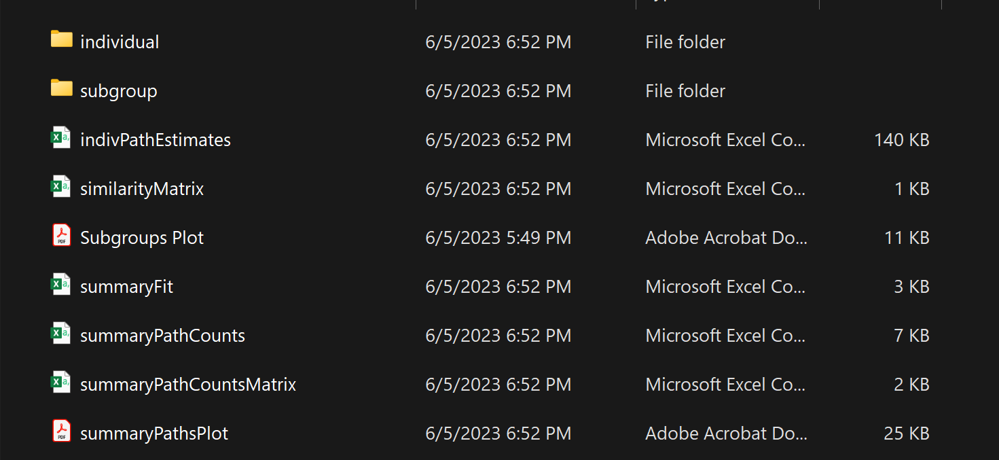
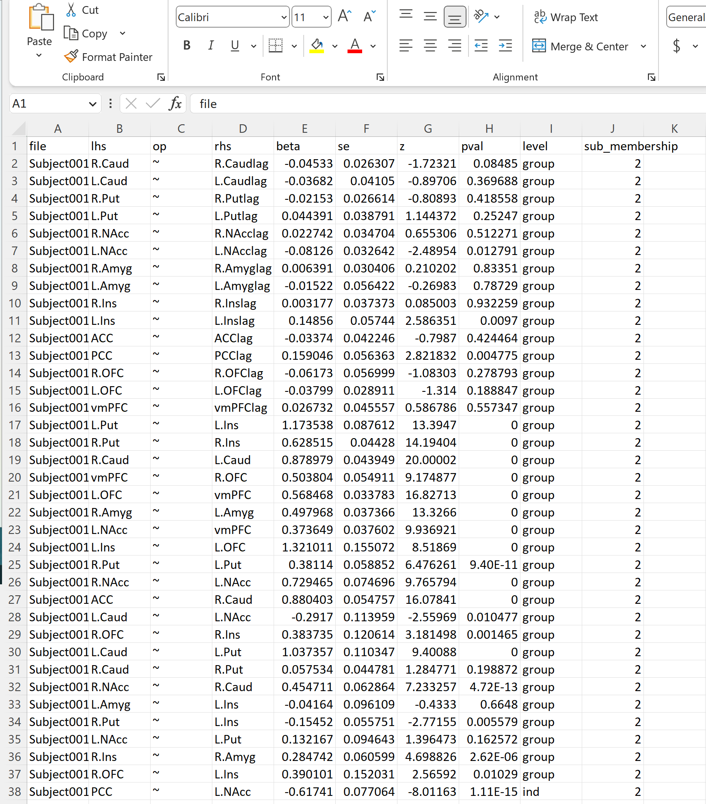
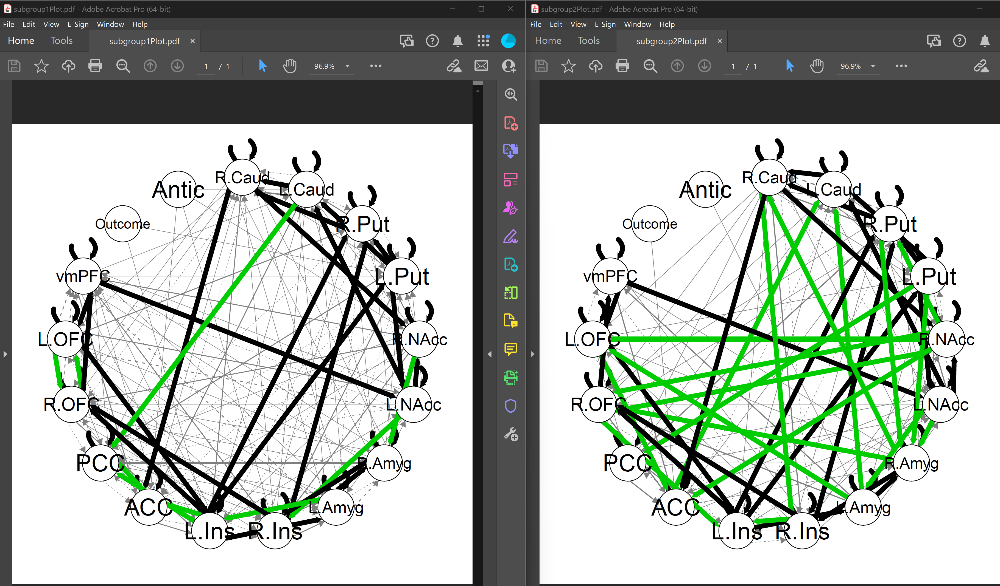
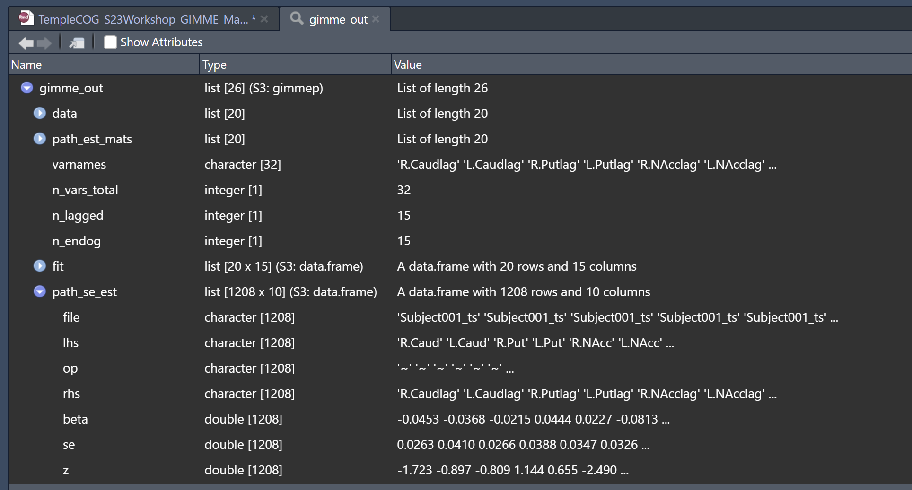

```{r setup, include=FALSE}
knitr::opts_chunk$set(echo = TRUE, warning = FALSE)
```

This R Markdown file was developed for Temple's Coding Outreach Group (COG) summer 2023 workshop series. It will walk through an applied usage of Group Iterative Multiple Model Estimation (GIMME). GIMME is a free to use R package and was developed by Dr. Kathleen Gates at UNC. Any users should first consult, at minimum, the [introductory GIMME manuscript](https://pubmed.ncbi.nlm.nih.gov/22732562/), the [subgroup manuscript](https://pubmed.ncbi.nlm.nih.gov/27925768/) (if using them), and the [GIMME website](https://tarheels.live/gimme/). The COG workshop also includes this brief conceptual introduction to GIMME that should provide a basic foundation for new users: [Slides](https://github.com/TU-Coding-Outreach-Group/cog_summer_workshops_2023/blob/master/gimme/GIMME_slides.pptx) and [Recording](ENTER LINK TO RECORDING AFTER WORKSHOP).

# Getting Started
Installing GIMME is quite easy. It is also updated on a somewhat frequent basis so users should check and install the newest version when starting a new project. The installation includes all dependencies, mainly lavaan which is the SEM package GIMME is built on.
We will also install other packages that we will use later. 
```{r, message = FALSE}
  # Installing pacman if it's not present
  if (require("pacman") == FALSE){
    install.packages("pacman")
  }
  
  # Using pacman to load necessary packages
  pacman::p_load(gimme, here)
```

We can also start by defining our working directory and there are at least two ways to do this. We can manually specify this by saving a filepath string as a variable. If you've downloaded the whole workshop directory, it should include a .here file and if it does, then the `here::here()` function should automatically identify your directory. Either way works. We'll default to manual to be safe.

```{r}
dir <- "C:/Users/.../gimme/"
# dir <- here::here()
```

```{r Introduction Video, echo = FALSE}
vembedr::embed_url("https://www.youtube.com/watch?v=1ZH6NXZoRAw")
```

# Data Formatting
GIMME requires specific data formatting, detailed [here](https://tarheels.live/gimme/preparing-data-and-environment-for-gimme/). 

* Each individual must contain 1 distinct datafile for all of their time series data. 
* For each individual, data should be organized such that columns are variables and rows are observations. 
  + Row names should not be included, column names are highly recommended. Each individual must have identical columns. 
* Missing data is permitted, and should be marked as NA. 
* GIMME almost permits up to 2 *exogenous* variables, or external variables that can only affect other variables (and not be affected *by* them)
  + For example, task events in an fMRI scan or weather in an EMA study
* Data can be entered as either an R list, where each element is an individual's data table, or a local directory that contains .csv files, one for each individual. 
  + I personally recommend the latter, due to believing it is better data management and I have anecdotally run into issues with using GIMME via R lists. 
  
Please download example data from [here](https://github.com/TU-Coding-Outreach-Group/cog_summer_workshops_2023/blob/master/gimmie/Data.zip) to continue with this walk through. This is fMRI BOLD data from 15 ROIs and 2 exogenous variables from Dr. Tom Olino's TADS study. I only included data from 20 individuals for timing purposes. 
This is an example of what a single individual's data file can look like. The first 15 columns are brain regions, the second two columns are task events (occurring or not occurring). Each individual's file will look exactly like this, just with different data. 


The data downloaded above is formatted and ready to use. Most fMRI times series data is extracted in this format already so will require little-to-no additional data management. If you are using the example data or your own data is already formatted correctly, move on to the next section. 

EMA data is often organized in Long format, which requires a couple steps to prepare for GIMME. 

**Coding Task:** Let's do a quick coding check for how we could (1) split a long format dataframe (called `long_df`) of all participants (`long_df$ID`) into individual dataframes for each participant, and (2) save each participant's dataframe as an individual .csv file. 
Take a second to think of your code, then click the 'Code' button on the right to see one solution. 

```{r, code="'\n\n\n\n'", results=F}

```

Click `CODE` to see the solution! ==>

```{r, class.source = 'fold-hide', eval=FALSE}
#Divdes the long_df into groups based on id
data_list <- split(long_df,
                   long$ID) 

#creates vector of file names, concatenating a path, an id, and .csv
filenames <- paste0(dir, 
                    names(data_list), 
                    ".csv") 

#Map applies a function (write.csv) with arguments of corresponding elements in vectors
Map(write.csv,
    data_list,
    filenames)  
```

**(Live workshop) - Data formatting questions?**


# GIMME Arguments
GIMME is quite easy to run. It has just a couple mandatory arguments, and several additional options. Use help(gimme) to see all of them, but here are some basic ones we can think about. There are some very interesting extensions that I recommend looking into yourself. 

**Coding Task:**
Copy and paste the chunk below into your R and take a guess how we would fill out each empty argument

```{r, eval = FALSE}
gimmeSEM(data        = ,
         out         = ,#You don't have to create this folder, GIMME will for you
         sep         = ,
         header      = ,
         ar          = ,#We will almost always want these. But, with some fMRI scans with TR < 1s, they can become problematic..
         plot        = TRUE,
         subgroup    = TRUE, #This enables the search for data-driven subgroups
         exogenous   = , #These are our task events
         conv_vars   = ,
         conv_length = , #For fMRI, would we need to convolve our task events by anything? 
         conv_interval = , #Interval of events, TR for fmri
         standardize = TRUE,
         groupcutoff = , #What percentage of individuals must have a path for it to be considered group-level
         subcutoff   = , #Same, but for subgroups
         ms_allow         = FALSE, 
         #We don't cover this here, but this is worth looking into, especially if directionality is important for your study
         #https://psycnet.apa.org/record/2022-16666-001
        )
```

# Running GIMME
Applying this to our data, it looks something like this (click the Code button below).

Please note this will take about 1-2 hours to run, and this increases quickly with more data. To quickly move forward with the walkthrough, you can download the output [here](ENTER GITHUB LINK TO OUTPUT FILE). However, you should run this yourself so you get the output directory stored locally. It is good practice to save the output immediately so you do not have to end up re-running GIMME. 

```{r, message = FALSE, warning = FALSE, eval=FALSE, class.source = 'fold-hide'}
gimme_out <- gimmeSEM(data = paste0(dir, 'Data'),
                      sep = ",",
                      header = T,
                      out = paste0(dir, 'Output'),
                      ar = T,
                      plot = T,
                      subgroup = T,
                      standardize = T,
                      exogenous   = c('Outcome','Antic'),
                      conv_vars = c('Outcome','Antic'), 
                      conv_length = 16,
                      conv_interval = 2,
                      groupcutoff = .75,
                      subcutoff = .5)
saveRDS(gimme_out,
        paste0(dir, 'gimme_output.rds'))
```

If you run this yourself, GIMME tells will tell you it finished running normally, and found two subgroups. What do things look like?
```{r, message=FALSE}
gimme_out <- readRDS('gimme_output.rds')
plot(gimme_out)
```

The bold black paths are group-level paths. We can see there are a good amount of them, and every region has a significant autocorrelation with itself at the group-level (the recursive arrows). We did not find any group-level paths involving our exogenous task variables. We also see all paths are continuous, not dashed, meaning all are contemporaneous (not lagged).

The feint gray paths are individual-level paths. We see there is a large amount of heterogeneity in these paths, and some are lagged as well. 

The green paths are subgroup-level paths. From this view, we can't see which paths belong to which subgroups. We'll explore that shortly. 


**(Live workshop) - Questions about Arguments?**


# GIMME Output 
GIMME outputs an R object that contains all relevant information, as well as plots and results in the output directory specified in the call. 

### Output Directory
Things are easier to look at manually in the directory. Here's what it looks like:




The **indivPathEstimates** .csv file is where most of the relevant information is.




This file has all model results for GIMME models for each participant,including group, subgroup (if estimated), and individual-level paths. 

* The path is indicated by **rhs** (right hand side) ~ **lhs** (left hand side).
  + You can think of this like writing a regression out (dv ~ iv, or y = mx + b). So, the lhs variable will have the arrow being pointed *toward* it
  + The first path here is from the Caudate lag (at t-1) to the Caudate. This is an autoregressive path, as all of the first 15 paths are since all regions had a significant autocorrelation.
* **Beta** and **SE** are your path coefficients and error values. You can also see the path significance value.
  + These are useful for downstream analyses
* **Level** indicates group, subgroup, or individual. 
  + Group paths are listed first, such as all these autoregrssive paths. These paths will be there for every individual individual, but the coefficients vary. 
  + Subgroup paths will be present for each individual in that subgroup, but again can have coefficients vary. 
  + The presence of invididual-level paths will vary between individuals. Though, multiple individuals can of course have the same individual-level path (the amount of them will have to be lower than the GIMME group cutoff you specified.)
    + If subgroups were estimated, we can also see which **sub_membership** an individual belongs to. 
    
    
* The **SimilarityMatrix** file is relevant to the subgroup estimation. We will not cover this, but here is a relevant resource for subgroup validation after GIMME estimation: https://gateslab.web.unc.edu/programs/perturbr/
  + In my opinion, subgroup validation is absolutely necessary and I don't trust papers that don't examine their solutions closely. 
* The **SubgroupsPlot** file is a graph that shows how the individuals clustered in the subgrouping solution. This does not show how the subgroups differ.
* The **SummaryFit** file provides fit info. This is important to check for model reliability. 
* The **SummaryPathsCounts** file shows how many individuals have each path. This can be useful for downstream analyses. 


If you go into the **subgroup subdirectory** we can get some nice plots showing us how our subgroups differ. Here, the second subgroup has a much denser network. 




As another reminder, please see [this resource](https://gateslab.web.unc.edu/programs/perturbr/) for subgroup validation, or consider your own alternative procedures. 

* The individual subdirectory has individual path estimates in separate files. But, the **IndPathEstimates** file we first discussed in the main output directory is the most important file you will work with. 
  * There are also individual-specific plots here, which can be interesting for very person-centered work. 

### R Object
The GIMME R output object, here called gimme_out, contains **all of the information in the output directory**, so again it is an important object to save (saveRDS). If you have some proficiency with R, you can continue working on downstream analyses with this object (ideal). The gimme_out$path_se_est list has the same information as the indivPathEstimates file, making it your go-to. You can see that information here: 



# Checkpoint
Thus far, we have loaded our formatted data into R, used various GIMME arguments to estimate group, subgroup, and individual-level network models, and explored the output format. 

**(For live workshop) - Questions?**

In sum, we have estimated networks of temporal relationships between variables, estimated at group, individual, and (maybe) subgroup levels. For many projects, this in itself an interest result that can be the focus of a mansucript. 
For example, if using fMRI data, perhaps you have interesting findings about how a task effects the brain's connectivity or novel insights into the connections between two specific regions. Or, in EMA data, perhaps you've just discovered how two emotions affect each other over the course of a week for students experiencing depression.
While these results can be the foundation for an interesting project, many will want to take things further to relate the network models to external outcomes in downstream analyses.

We will explore this briefly, but this is where roads will begin quickly diverging based on your projects so you will likely need to work this out yourself or read other GIMME manuscripts.

## Downstream Analyses
Downstream analyses will largely depend on your research question. For the most part, everything you would typically do with a network model (e.g., fMRI connectivity), you can also do with GIMME models, plus much more. 
I'll briefly mention some options and we can test some code, but it would likely be useful to skim what other folks have done as well. You can search GIMME papers yourself on scholar or looking at papers citing the original GIMME manuscript, or look at this collection: https://tarheels.live/gimme/papers/


## Examining Heterogeneity

One path that is at the heart of GIMME's purpose is characterizing heterogeneity. 

* Did you find data-driven subgroups? Were they validated? 
* How many group-level paths did you find, how many or few are there in relation to the average number of individual-level paths?
* How do GIMME models differ from a model you would get in a typical data-aggregation method (e.g., your typical analysis method, like DCM for fMRI)
  + For an example of this last point, you can see my paper with GIMME [here](https://doi.org/10.1162/netn_a_00306). The paper also links to open code that you can follow to use the method yourself if you'd like. 
  
For any discussion of heterogeneity, you should also consider if the uncovered individual differences are actually heterogeneity, or just noise. See this paper for a useful discussion: https://pubmed.ncbi.nlm.nih.gov/36318496/

### Coding Task

Explore the gimme_out R object. Can you script the following?

1. Create a dataframe that contains all non-autoregrssive group level paths, their beta and SE for all participants
2. Create a clean table that includes each group-level path the average beta coefficient, and the average SE
3. Create a dataframe that lists all individual level paths and how many individuals each path was significant in 
Click the Code button below to see a potential solution. 

```{r, code="'\n\n\n\n'", results=F}
 
 
 
```

Click `CODE` to see Solution 1 ==>
```{r, class.source = 'fold-hide', eval=FALSE}
#Create a df of all participants, path nodes, beta, and SE
group_paths_all <- data.frame(gimme_out[["path_se_est"]][["file"]],gimme_out[["path_se_est"]][["level"]],
                              gimme_out[["path_se_est"]][["rhs"]],gimme_out[["path_se_est"]][["lhs"]],
                              gimme_out[["path_se_est"]][["beta"]],gimme_out[["path_se_est"]][["se"]])
#Easy column names
colnames(group_paths_all) <- c('id','level','from','to','beta','se')
#Remove all non-group level paths
group_paths_all <- group_paths_all[group_paths_all$level=='group',]
#We can see the first 15 paths for all participants are autoregressive (all 15 ROIs had significant autocorrelations)
group_paths_all
#Remove the first 15 rows for each ID
group_paths <- do.call(rbind, lapply(split(group_paths_all,as.character(group_paths_all$id)), function(x) x[-(1:15),]))
#DONE 

```

Click `CODE` to see Solution 2 ==>
```{r, class.source = 'fold-hide', eval=FALSE}
#How many group level paths? number of paths / number of participants
nrow(group_paths)/20 #21
#Create a table with 21 rows and 2 columns (path, beta (se))
group_paths_tab <- as.data.frame(matrix(NA,21,2))
colnames(group_paths_tab) <- c('Path','Beta (SE)')
#Group path names
group_paths_tab[1] <- paste0(group_paths$from[1:21],'->',group_paths$to[1:21])
#Group path values
group_paths$lab <- seq(1:21)
group_paths_tab[2] <- paste0(round(tapply(group_paths$beta, group_paths$lab, mean),3),' (', #beta
                             round(tapply(group_paths$se, group_paths$lab, mean),2),')') #se
#DONE
```

Click `CODE` to see Solution 3 ==>
```{r, class.source = 'fold-hide', eval=FALSE}
#Indices of individual-level paths
ind_id <- which(gimme_out[["path_se_est"]][["level"]] == "ind",arr.ind = T)
#Just need lhs and rhs
ind_paths <- gimme_out[["path_se_est"]][ind_id,]
ind_paths <- ind_paths[c(2,4)]

#Get number of duplicates for unique rows
library(dplyr)
ind_paths_unique <- ind_paths %>% group_by_all() %>% count
#DONE
#You could also subset to identify individual-level rows that occured in a certain amount of people
#Let's say paths occuring in at least 4 people (20% of sample)
ind_paths_4 <- ind_paths_unique[ind_paths_unique$n > 3 ,]

```

## Subgroup Differences

* Again, if you estimated subgroups you should focus on validating them. This can include using the referenced [perturbr package](https://gateslab.web.unc.edu/programs/perturbr/), cross-validation approaches, or split sample replications. For fMRI, you should also consider if subgroups differ by head motion (e.g., are these subgroups distinct in signal or noise?) 
  + See my previous [publication](https://doi.org/10.1162/netn_a_00306) as an example and open code. 
* After validating, there could be several interesting questions:
  + How does subgroup membership relate to an external variable?
    + Is one sex more likely to be in subgroup 2? What does this mean in relation to the paths in this subgroup?
    + Does a clinical subsample dominate one of the subgroups? 
  + Is one subgroup much denser than the others (i.e., have more paths)? 
    + What does this difference in *centrality* mean?
  + Is there a theoretical reason you can hypothesize for these subgroups? Can you test this in a follow-up study?
  
### Coding Task

Can you script the following?

1. How many individuals are in each subgroup?
2. How many subgroup-level paths are in each subgroup? 

```{r, code="'\n\n\n\n'", results=F}
 
 
 
```

Click `CODE` to see Solution 1 ==>
```{r, class.source = 'fold-hide', eval=FALSE}
unique_out <- gimme_out[["path_se_est"]][!duplicated(gimme_out[["path_se_est"]][["file"]]),]
table(unique_out$sub_membership)
#DONE
```

Click `CODE` to see Solution 2 ==>
```{r, class.source = 'fold-hide', eval=FALSE}
unique_out 
#Subject 1 is in subgroup 1, subject 2 is in subgroup 2. 
sub1_paths <- gimme_out[["path_se_est"]][gimme_out[["path_se_est"]][["file"]]=="Subject001_ts",]
#Number of subgroup-1-level paths
nrow(sub1_paths[sub1_paths$level=="sub",]) #19
sub2_paths <- gimme_out[["path_se_est"]][gimme_out[["path_se_est"]][["file"]]=="Subject002_ts",]
#Number of subgroup-2-level paths
nrow(sub1_paths[sub2_paths$level=="sub",]) #9
#DONE
```

## Path Estimates

In my mind, this is the most powerful use of GIMME. How do invidual differences in *person-centered* paths, rather than group-aggregate, relate to external outcomes?
(To be clear, group-level GIMME paths are still person-centered, as they were present for a majority of the sample. The contrast I am making is to using more traditional, aggregation-based approaches).

The field has taken multiple approaches to do this, and there are many possibilities yet to be explored. Here are some common options:

* How do individual differences in a **specific path** relate to an external outcome
  + Ideally, paths of interest preregistered based on theoretical interest.
  + In a more exploratory way, could test many then correct for multiple comparisons.
  + Test path presence or absence (individual-level only)
    + e.g., Are males more likely to have a path from regions X to Y. 
  + Or differences in path coefficients (group or individual-level)
    + e.g., Do people with depression have higher connectivity strength from regions A to B. 
  + Example: 
* Multivariate machine learning prediction from **multiple paths**
  + Leverage the multivariate nature of networks to relate differences in multiple paths to a specific outcome
  + Goal is typically overall variance explained in outcome, rather than effect of single path
    + e.g., Can person-centered GIMME networks of daily affect (EMA) predict alcohol use? 
  + Ideally done with larger samples, cross-validation, and replication
  + Example: https://doi.org/10.1162/netn_a_00306
* How do differences in **overall network structure** relate to outcomes?
  * I like this approach because it treats paths less independently, which is closer to our theoretical expectations. 
  + What is the effect of having a *denser network*? 
    + This gets into graph theory, and there are a lost of interesting implications to explore
  + Most typically, count number of paths in an individual-level network
    + e.g., Do individuals with denser resting state brain networks perform better on memory tests? 
    + Example: 
  + In my mind, a more interesting approach is to explore *modular centrality*
    + How important is a certain node, or group of nodes, in the overall network?
    + Total number of paths attached to a node (degree), or each path times its beta coefficient (weighted degree/strength)
      + e.g., Do individuals with a stronger reward brain hub engage in more reward-seeking behaviors
      + I have not found examples, but I am doing this soon. Preregistration here: https://osf.io/aqs8m

### Coding Task

The previous coding tasks will be useful here. Let's try one more thing as well:

* Create a weighted centrality measure a **dorsal striatum hub** for each participant. This is the sum of the magnitude of *all paths that involve any of the left or right caudate or putamen nodes*. This will require some thinking + grep skills!

```{r, code="'\n\n\n\n'", results=F}
 
 
 
```

Click `CODE` to see Solution ==>
```{r, class.source = 'fold-hide', eval=FALSE}
#Remove Autoregressive Paths (first 15 rows for id)
paths_all <- data.frame(gimme_out[["path_se_est"]][["file"]],gimme_out[["path_se_est"]][["level"]],
                              gimme_out[["path_se_est"]][["rhs"]],gimme_out[["path_se_est"]][["lhs"]],
                              gimme_out[["path_se_est"]][["beta"]],gimme_out[["path_se_est"]][["se"]])
#Easy column names
colnames(paths_all) <- c('id','level','from','to','beta','se')
#Remove the first 15 rows for each ID (autoregressive paths)
paths_clean <- do.call(rbind, lapply(split(paths_all,as.character(paths_all$id)), function(x) x[-(1:15),]))

#Create single path name
for (i in 1:nrow(paths_clean)){
  paths_clean$path[i] <- paste0(paths_clean$from[i],'-',paths_clean$to[i])
}

#Enter ROIs of hub
striatum <- c('Caud.L','Caud.R','Put.L','Put.R','Caud.Llag','Caud.Rlag','Put.Llag','Put.Rlag')
paths_clean$striatum <- 0

#Does path contain any of ROIs
for (iG in 1:nrow(paths_clean)){
  for (iS in 1:length(striatum)){
    if(any(grepl(paste0('\\<',striatum[iS],'\\>'),paths_clean$path[iG])) == TRUE){
      paths_clean$striatum[iG] <- 1
    }}}
  
striatum_strength <- as.data.frame(matrix(nrow=20,ncol=2))
colnames(striatum_strength) <- c('id','hub_strength')  
striatum_strength$id <- unique(paths_clean$id)
for (i in 1:nrow(striatum_strength)){
  striatum_strength$hub_strength[i] <- sum(abs(paths_clean$beta[paths_clean$id == striatum_strength$id[i] & 
                                               paths_clean$striatum == 1]))}
mean(striatum_strength$hub_strength)
sd(striatum_strength$hub_strength)
#DONE
```


# Ackowledgements

Workshop and Markdown created by Matt Mattoni. Many thanks to the Pitt Methods Summer Workshop on GIMME, taught by Dr. Katie Gates. 
Dr. Katie Gates is the developer of GIMME. Further resources can be found on her website: https://tarheels.live/gimme/

Main GIMME paper: 
Gates, K. M. & Molenaar, P. C. M. (2012). Group search algorithm recovers effective connectivity maps for individuals in homogeneous and heterogeneous samples, NeuroImage, Volume 63, Issue 1(15), 310-319, doi:10.1016/j.neuroimage.2012.06.026

Subgroup-GIMME paper:
Gates, K. M., Lane, S. T., Varangis, E., Giovanello, K., & Guiskewicz, K. (2017). Unsupervised classification during time-series model building. Multivariate behavioral research, 52(2), 129-148.

Please see the full list of GIMME methodological papers for further information: https://tarheels.live/gimme/papers/

