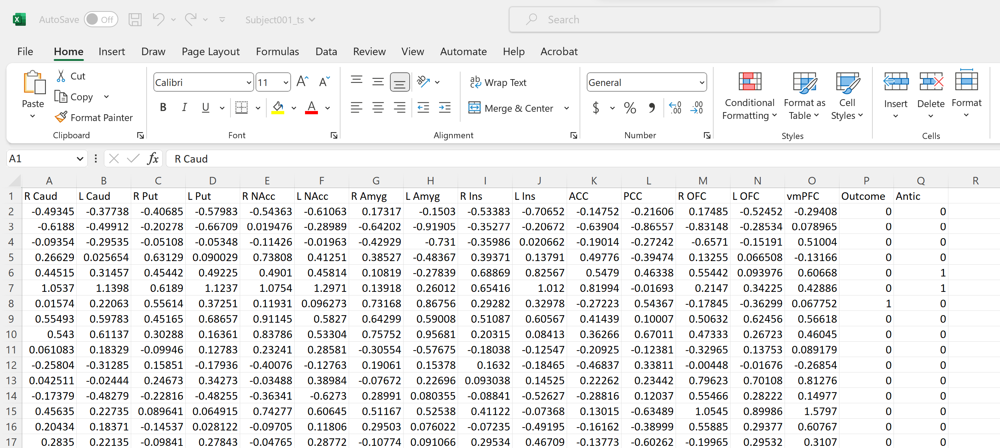

# UNDER CONSTRUCTION
# Coding Outreach Group Summer Workshop 2023
# GIMME
06/29/2023

__**Content creator:**__ Matt Mattoni
__**Content editor:**__ 

## Description
This R Markdown file was developed for Temple's Coding Outreach Group (COG) summer 2023 workshop series. It will walk through an applied usage of Group Iterative Multiple Model Estimation (GIMME). GIMME is a free to use R package and was developed by Dr. Kathleen Gates at UNC. Any users should first consult, at minimum, the [introductory GIMME manuscript](https://pubmed.ncbi.nlm.nih.gov/22732562/), the [subgroup manuscript](https://pubmed.ncbi.nlm.nih.gov/27925768/) (if using them), and the [GIMME website](https://tarheels.live/gimme/). The COG workshop also includes this brief conceptual introduction to GIMME that should provide a basic foundation for new users: [Slides]() and [Recording] (to be available after workshop is done).
  

## Prerequisites
This workshop demands that users:
1. Have R and RSTudio Downloaded
2. Download the GIMMIE package in R
3. Download the example data from the cog_summer_workshops_2023/gimmie folder

## Set Up (do before the workshop)
## Getting Started
Installing GIMME is quite easy. It is also updated on a somewhat frequent basis so users should check and install the newest version when starting a new project. The installation includes all dependencies, mainly lavaan which is the SEM package GIMME is built on.
We will also install other packages that we will use later. 
```{r, message = FALSE}
#install.packages("gimme")
#Remove the above # to run the code
library(gimme)
```

## Data Formatting
GIMME requires specific data formatting, detailed [here](https://tarheels.live/gimme/preparing-data-and-environment-for-gimme/). 

* Each individual must contain 1 distinct datafile for all of their time series data. 
* For each individual, data should be organized such that columns are variables and rows are observations. 
  + Row names should not be included, column names are highly recommended. Each individual must have identical columns. 
* Missing data is permitted, and should be marked as NA. 
* GIMME almost permits up to 2 *exogenous* variables, or external variables that can only affect other variables (and not be affected *by* them)
  + For example, task events in an fMRI scan or weather in an EMA study
* Data can be entered as either an R list, where each element is an individual's data table, or a local directory that contains .csv files, one for each individual. 
  + I personally recommend the latter, due to believing it is better data management and I have anecdotally run into issues with using GIMME via R lists. 
  
Please download example data from [here](Data/) to continue with this walkthrough. This is fMRI BOLD data from 15 ROIs and 2 exogenous variables from Dr. Tom Olino's TADS study. I only included data from 20 individuals for timing purposes. 
This is an example of what a single individual's datafile can look like. The first 15 columns are brain regions, the second two columns are task events (occuring or not occuring). Each individual's file will look exactly like this, just with different data. 


The data downloaded above is formatted and ready to use. Most fMRI times series data is extracted in this format already so will require little-to-no additional data management. If you are using the example data or your own data is already formatted correctly, move on to the next sextion. 

EMA data is often organized in Long format, which requires a couple steps to prepare for GIMME. To do this, with a long-format dataset called 'long_df', you could run some version of the following code, uncommented:
```{r}
#data_list <- split(long_df,long$ID)
#filenames <- paste0("C:/Users/.../",names(data_list), ".csv")
#Map(write.csv,data_list,filenames)
```
    
## Workshop objectives:


## Workshop materials:
- [Notebook Viewer](https://github.com/TU-Coding-Outreach-Group/cog_summer_workshops_2023/blob/master/gimme/index.html)


## What We Won't Cover:

## Outline
| Section | Description | Time |
| --- | --- | --- |
| Intro | Data formatting questions | 10 mins |
| GIMMIE Arguments | Required arugements and running GIMMIE | 15 mins |
| GIMMIE Outputs | Examing the output of GIMMIE, formatting as an R object | 15 mins |
| Downstream Analyses | Statistical analyses that can be done with GIMMIE output | 15 mins |
| Q&A | Any questions? | 5 mins |


## Additional Resources
Workshop and Markdown created by Matt Mattoni. Many thanks to the Pitt Methods Summer Workshop on GIMME, taught by Dr. Katie Gates. 
Dr. Katie Gates is the developer of GIMME. Further resources can be found on her website: https://tarheels.live/gimme/

Main GIMME paper: 
Gates, K. M. & Molenaar, P. C. M. (2012). Group search algorithm recovers effective connectivity maps for individuals in homogeneous and heterogeneous samples, NeuroImage, Volume 63, Issue 1(15), 310-319, doi:10.1016/j.neuroimage.2012.06.026

Subgroup-GIMME paper:
Gates, K. M., Lane, S. T., Varangis, E., Giovanello, K., & Guiskewicz, K. (2017). Unsupervised classification during time-series model building. Multivariate behavioral research, 52(2), 129-148.

Please see the full list of GIMME methodological papers for further information: https://tarheels.live/gimme/papers/


### Packages

