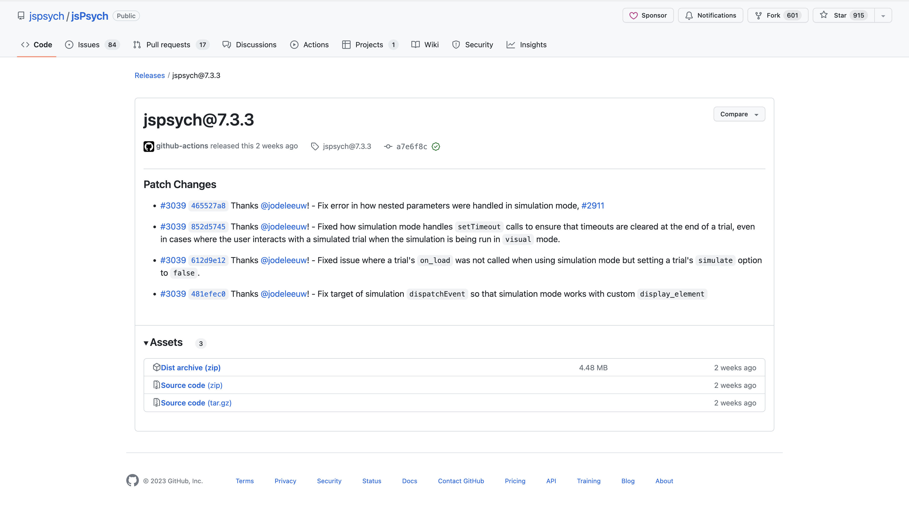
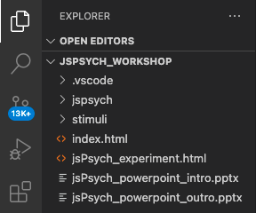
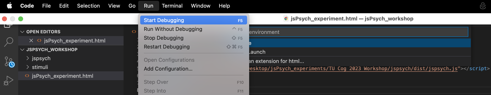
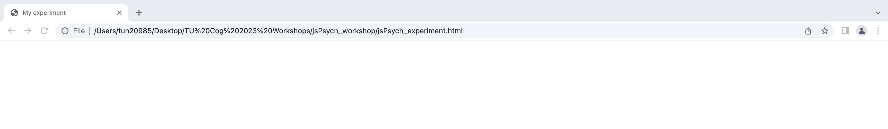
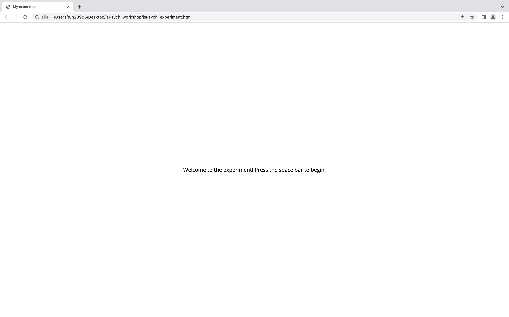
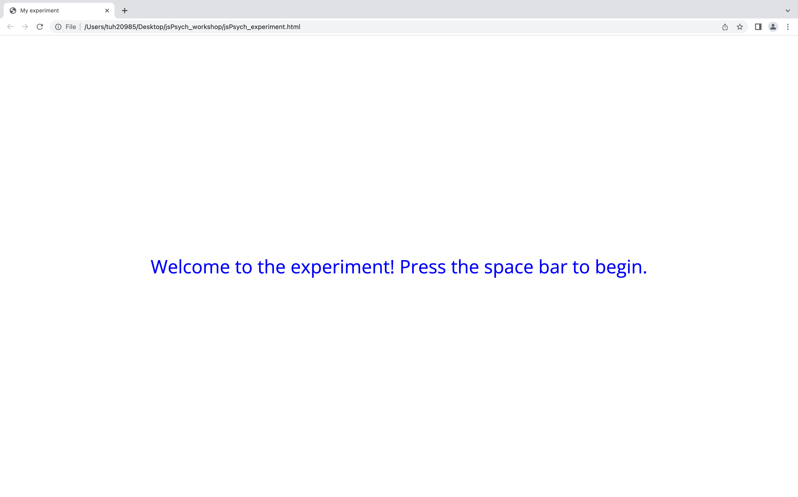

```{r setup, include=FALSE}
knitr::opts_chunk$set(echo = TRUE, error = FALSE)
```


# Description

This workshop will cover how to use [jsPsych version 7.3.3](https://github.com/jspsych/jsPsych/releases/tag/jspsych%407.3.3) to build psychological experiments. jsPsych is a free, open-source software that employs a JavaScript framework for creating behavioral experiments that run in a web browser. It's a popular alternative to PsychoPy and E-Prime for task development, can be used in both behavioral and neuroimaging tasks, and supports online study capabilities.


## Outline

| Topic | Description | Time |
| :---: | :---: | :---: |
| Intro | Workshop overview | 5 mins |
| Setting up a jsPsych script | jsPsych and Visual Studio Code set-up | 10 mins |
| Building an experimental trial | Learning how to integrate Javascript, HTML, and CSS | 15 mins |
| Building a full experiment | Trials, Procedures, and Timelines | 25 mins |
| Conclusion & General Notes | Review, Pavlovia compatibility, tutorial suggestions, etc. | 5 mins | 


# --- Intro: Workshop Overview ---

## Set Up & Prerequisites

Before the workshop:

1. Download Visual Studio Code, which is a programming-friendly text editor that works with Windows, OSX/Mac, and Linux, and can be downloaded at the following link:  https://code.visualstudio.com/Download

2. Download the latest release of jsPsych, which as of now is jsPsych 7.3.3. The jsPsych software is a set of files located in the Dist Archive zipped folder at the following link (https://github.com/jspsych/jsPsych/releases/tag/jspsych%407.3.3).

3. Download the 'jsPsych_workshop' folder from the TU COG Github. This is the folder containing the 'stimuli' folder, which has images that we will use as part of the experimental task. We will be working in this "jsPsych_workshop" folder for the purposes of this workshop and we will be saving our experimental task file to this folder.


# Intro to jsPych

Now, let's watch the intro video and then get started on the workshop!


```{r Intro Video, echo = FALSE}
vembedr::embed_url("https://www.youtube.com/watch?v=-wmu1B3tXJQ")
```

Today will begin with an introduction to the syntax structure that jsPsych uses, which relies on JavaScript, HTML, and CSS. After the introduction, we will create a task using jsPsych. 

HTML stands for HyperText Markup Language and is the code that is used to structure a web page and its content.
CSS stands for Cascading Style Sheets language and is the code that is used to stylize/customize elements that appear on the HTML page
JavaScript is the programming language that is used to make interactive webpages. Ultimately, jsPsych, through JavaScript, has built-in plugins that work with HTML and CSS capabilities in order to run an experimental task on web browsers.


# --- Setting up the jsPsych script | jsPsych and Visual Studio Code set-up --- 

## Getting Started in Visual Studio Code

Once you've downloaded the jsPsych software (the Dist Archive zip file) you'll want to move the jsPsych software (which should exist as a folder called "jspsych" after you unzip the Dist Archive file) to the "jsPsych_workshop" that you downloaded from the GitHub. We will be working in this "jsPsych_workshop" folder for the purposes of this workshop. 

Please also make sure that you've already downloaded Visual Studio Code at the following link: https://code.visualstudio.com/Download

We will be using the Visual Studio Code editor to write our jsPsych script!

{width=70%}


## Directory Structure

The first thing that we'll do is open up Visual Studio Code and navigate to the "jsPsych_workshop" folder that we just created. In Visual Studio Code, you can click the folders icon in the top left, which will then show an Explorer menu. Click the "No Folder Opened" tab and then the "Open Folder" tab and navigate to the "jsPsych_workshop" folder. Next, you want to drag the "jspsych" folder that we just downloaded (which contains the jsPsych software files) to the "jsPsych_workshop" folder. Then, create a new file called "jsPsych_experiment.html" and save it in the "jsPsych_workshop" folder. 

Here's what your directory should look like with the "stimuli" folder, the "jspsych" folder, and the newly created "jsPsych_experiment.html" file saved directly in the "jsPsych_workshop" directory:


{width=50%}


## Step 1: Create an HTML file

The first step will be to add some basic code that nearly all HTML documents have in common. Here's a typical bare-bones HTML document. This HTML code allows JavaScript to run scripts on a web page.

```
<!DOCTYPE html>
<html>
  <head>
    <title>My experiment</title>
  </head>
  <body></body>
</html>
```


## Step 2: Testing your script

Now that we've added some code to our script, let's open up the script on a web page and see what it looks like. In Visual Studio Code, click the "Run" button in the top toolbar and then click "Start Debugging". A pop-up should appear indicating which browser you want to run the script in. Click the browser. At this point, a blank web page should appear and the title of the page will be "My experiment". 


{width=100%}
{width=50%}

# --- Building an experimental trial | Learning how to integrate Javascript, HTML, and CSS --- #

## Step 3: Loading in jsPsych

In case the context helps, plugins to jsPsych are what libraries are to R and Python. In order to use jsPsych, we will need to load the relevant plugins that we want to use to create the experimental trials. This is similar to loading a library in R or Python.

To load a plugin, we need to add a \<script\> \<\/script\> tag. Tags, such as the \<script\> tag, work similarly to parentheses, such that a tag needs to be opened and closed as such: \<script "blah blah blah"\> \<\/script\>. 

After opening the script tag, we will use the "src" function and copy the pathway to the "jspsych.js" file, which is located in the jspsych\/dist\/ folder that we downloaded from the Dist Archive zip file. Below, I'm attaching the \<script\> tag with the pathway to the "jspsych.js" file included. 

As you can see, the \<script\> tag code applies the following structure: \<script "blah blah blah"\> \</script\>. Again, it helps me to think of these tags as parentheses (), except that the tags use the \<\> and \<\/\> structure. You can see the other tag codes, such as html, head, and body use the same \<\> and \<\/\> structure.


```
<!DOCTYPE html>
<html>
  <head>
    <title>My experiment</title>
    <script src="/Users/tuh20985/Desktop/TU Cog 2023 Workshops/jsPsych_workshop/jspsych/dist/jspsych.js"></script>
  </head>
  <body></body>
</html>
```

## Step 5: Load the jsPsych CSS stylesheet

Next, we will load the jsPsych CSS stylesheet, which basically imports the standard visual styles that jsPsych uses by default. Importantly, this will also allow us to customize some of the aesthetics of the task, such as font size, font color, background color, etc. 

In order to load the jsPsych stylesheet, we will need to add a \<link\> tag to the \<head\> section of the document. In the \<link\> tag, we will copy the pathway to the file called "jspsych.css" that is located in the jspsych\/dist\/ folder. We'll also need to include some CSS-specific bits of code before we close out the \<link\> tag in order for the CSS file to properly work.

```
<!DOCTYPE html>
<html>
  <head>
    <title>My experiment</title>
    <script src="/Users/tuh20985/Desktop/TU Cog 2023 Workshops/jsPsych_workshop/jspsych/dist/jspsych.js"></script>
  
    <link href="/Users/tuh20985/Desktop/TU Cog 2023 Workshops/jsPsych_workshop/jspsych/dist/jspsych.css" rel="stylesheet" type="text/css" />
  </head>
  <body></body>
</html>
```

## Step 6: Create a script element and initialize jsPsych

To add JavaScript code directly to the webpage, we will need to add a pair of \<script\> \<\/script\> tags after the \<body\> tags. Anything that is included in between these \<script\> \<\/script\> tags will define the experimental script.

To initialize jsPsych, we will need to use the initJsPsych() function, and save it to a variable called "jsPsych". We can add this line of code in between the \<script\> and \<\/script\> tags below. 

I'll start adding comments next to some lines of code in case that may be helpful. Comments, which are typically prefaced in R and Python with #, are prefaced with "\/\/" in JavaScript.

```
<!DOCTYPE html>
<html>
  <head>
    <title>My experiment</title>
    <script src="/Users/tuh20985/Desktop/TU Cog 2023 Workshops/jsPsych_workshop/jspsych/dist/jspsych.js"></script>
  
    <link href="/Users/tuh20985/Desktop/TU Cog 2023 Workshops/jsPsych_workshop/jspsych/dist/jspsych.css" rel="stylesheet" type="text/css" />
  </head>
  <body></body>
  <script>

//First, we have to initialize jsPsych. We can do this by using the initJsPsych() function, and saving it to a variable called jsPsych
var jsPsych = initJsPsych();

  </script>
</html>
```


## Step 7: Understanding what a jsPsych timeline is and how to use it

All jsPsych experiments are defined by a timeline. The timeline is an array that contains the set of trials we want to run in the experiment. 

We can define an empty timeline array by creating a variable called "timeline" and assigning empty brackets to reflect an empty timeline array.

We'll add trials to this timeline array as we create them.

```
<!DOCTYPE html>
<html>
  <head>
    <title>My experiment</title>
    <script src="/Users/tuh20985/Desktop/TU Cog 2023 Workshops/jsPsych_workshop/jspsych/dist/jspsych.js"></script>

    <link href="/Users/tuh20985/Desktop/TU Cog 2023 Workshops/jsPsych_workshop/jspsych/dist/jspsych.css" rel="stylesheet" type="text/css" />
  
  </head>
  <body></body>
  <script>

//First, we have to initialize jsPsych. We can do this by using the initJsPsych() function, and saving it to a variable called jsPsych
    var jsPsych = initJsPsych();


//Define empty timeline array
    var timeline = [];

  </script>
</html>
```

## Step 8: Loading a jsPsych plugin to display a welcome message.

Let's say we want to show a welcome message to the participant. To do this, we can use the html-keyboard-response plugin. In order to use the plugin, we need to load it with a \<script\> tag. We will load the html-keyboard-response plugin just like we loaded in jsPsych earlier.


```
<!DOCTYPE html>
<html>
  <head>
    <title>My experiment</title>
    <script src="/Users/tuh20985/Desktop/TU Cog 2023 Workshops/jsPsych_workshop/jspsych/dist/jspsych.js"></script>
    <script src="/Users/tuh20985/Desktop/TU Cog 2023 Workshops/jsPsych_workshop/jspsych/dist/plugin-html-keyboard-response.js"></script> // adding the html-keyboard response plugin here

    <link href="/Users/tuh20985/Desktop/TU Cog 2023 Workshops/jsPsych_workshop/jspsych/dist/jspsych.css" rel="stylesheet" type="text/css" />
  
  </head>
  <body></body>
  <script>

//First, we have to initialize jsPsych. We can do this by using the initJsPsych() function, and saving it to a variable called jsPsych
    var jsPsych = initJsPsych();

  </script>
</html>
```

## Step 9: Creating an experimental trial

Now that we've loaded the html-keyboard-response plugin, we can create the first experimental trial that uses the html-keyboard-response plugin and contains a simple string to show the subject. Let's greet the participant with a simple welcome message: "Welcome to the experiment. Press the space bar to begin".

One important thing to note is that each jsPsych plugin has its own unique knobs\/parameters that we can turn on or off depending on what we want to accomplish. These knobs are described in detail on each plugins documentation page, as well as demo of how each plugin works which is super helpful and can be used as models to build your own code! Here is the link to the html-keyboard-response plugin documentation page: https://www.jspsych.org/7.0/plugins/html-keyboard-response/. 

In order to create a trial that uses the html-keyboard-response plugin, let's create a trial object called "welcome".

At this point, it may be helpful to know that creating a trial and using a plugin always follows the same basic structure.

1) Create a trial object and call it whatever you want (i.e., "welcome")
2) Use the {} brackets to start and end the trial object
3) The "type" property will always reflect the name of the plugin you are using. You can easily find out what the name of your plugin is by opening up the plugin file in the \/jspsych\/dist\/ folder (for the html-keyboard-response plugin, the file would be plugin-html-keyboard-response.js) and checking the name of the variable at the top.
4) The "stimulus" property will always reflect the stimuli that you want to present to the participant (i.e., text, images, videos, etc.)
5) We will also use the "choices" parameter, however, not all plugins have this "choice" parameter. Again, each plugin has its own unique knobs\/parameters that you can toggle on/off depending on what you'd like to accomplish.


For our purposes, let's use the following knobs of the html-keyboard response plugin

1) type: jsPsychHtmlKeyboardResponse (the plugin we're using for this trial)
2) stimulus: "Welcome to the experiment. Press the space bar to begin" (the string we'll show to participants)
3) choices: [' '] (since we want participants to press the space bar to advance to the next trial)


```
//Create the first experimental trial called "welcome" and use the html-keyboard-response plugin to print a welcome message.
    var welcome = {
      type: jsPsychHtmlKeyboardResponse,
      stimulus: 'Welcome to the experiment. Press the space bar to begin.'
      choices: [' '],
    }
```


## Step 10: Adding the welcome trial to the experimental timeline

In order to add the welcome trial to the experiment, we will need to push it to the timeline array that we created earlier. By pushing the welcome trial to the timeline, this will add it to the end of the experimental array.

```
//Create the first experimental trial called "welcome" and use the html-keyboard-response plugin to print a welcome message.
    var welcome = {
      type: jsPsychHtmlKeyboardResponse,
      stimulus: 'Welcome to the experiment. Press the space bar to begin.'
      choices: [' '],
    }
    
//Push the welcome trial to the experimental timeline
  timeline.push(welcome);
```

## Step 11: Displaying the Data
jsPsych has a built-in function called "jsPsych.data.displayData()" that is useful for debugging your experiment. At the end of the experiment, it will show you all the raw data you've collected so far. It's especially helpful for checking the data during task development to see what data you're collecting and what data you may be missing.

All we need to do is tweak the code that we used to initialize jsPsych in Step 6

We will be using jsPsych's "on_finish" function, which basically calls functions to run at the end of the experiment. In this case, we are telling jsPsych to run the jsPsych.data.displayData() function at the end of the experiment so that we can see what data we've collected

```
//Below, we are adding the "jsPsych.data.displayData()" function, which will show us the raw data at the end of the experiment. 
//Here, the "on_finish:" function is basically saying: at the end of the jsPsych experiment, run this function (in this case, the jsPsych.data.displayData() function), which will show us the raw data at the end of the experiment
  var jsPsych = initJsPsych({
    on_finish: function() {
      jsPsych.data.displayData();
    }
  });
```

## Step 12: Preparing to run the experiment

Now that we have the timeline defined with the experimental trials that we want to run (in this case, just the welcome trial), we need to tell jsPsych to run this experiment.

We can get jsPsych to run the experiment by adding the jsPsych.run() function and passing in the array that defines the experiment timeline.

Again, the timeline is just an array containing the list of trials to run.

```
//Run the experiment!
  jsPsych.run(timeline);
```


## Step 13: Run the experiment!

At this point, this is what your code should look like.

Just like we did when we tested the script earlier, let's open up the script on a web page and see what the experiment looks like.  


```
<!DOCTYPE html>
<html>
  <head>
    <title>My experiment</title>
    <script src="/Users/tuh20985/Desktop/TU Cog 2023 Workshops/jsPsych_workshop/jspsych/dist/jspsych.js"></script>
    <script src="/Users/tuh20985/Desktop/TU Cog 2023 Workshops/jsPsych_workshop/jspsych/dist/plugin-html-keyboard-response.js"></script> 

    <link href="/Users/tuh20985/Desktop/TU Cog 2023 Workshops/jsPsych_workshop/jspsych/dist/jspsych.css" rel="stylesheet" type="text/css" />
  
  </head>
  <body></body>
  <script>

//First, we have to initialize jsPsych. We can do this by using the initJsPsych() function, and saving it to a variable called jsPsych
//We are also adding the "jsPsych.data.displayData()" function, which will show us the raw data at the end of the experiment. 
//Here, the "on_finish:" function is basically saying: at the end of the jsPsych experiment, run this function (i.e., the "jsPsych.data.displayData();" function), which will show us the raw data at the end of the experiment
  var jsPsych = initJsPsych({
    on_finish: function() {
      jsPsych.data.displayData();
    }
  });


//Define empty timeline array
    var timeline = []

//Create the first experimental trial called "welcome" and use the html-keyboard-response plugin to print a welcome message.
    var welcome = {
      type: jsPsychHtmlKeyboardResponse,
      stimulus: 'Welcome to the experiment. Press the space bar to begin.'
      choices: [' '],
    }

//Push the welcome trial to the experimental timeline
  timeline.push(welcome);


//Run the experiment!
  jsPsych.run(timeline);

  </script>
</html>
```


{width=80%}


## Step 14: Using HTML formatting to customize the welcome trial
In order to customize text, images, etc., we need to add HTML formatting code to the experimental trial.

Below are some short notes about HTML formatting:

The \<p\> \<\/p\> tag defines a paragraph.
The "style" attribute on a \<p\> tag assigns a unique style to that paragraph.
Here, we are using the <\p\> tag and the "style" attribute to change the "font-size" parameter to 50px and the "color" parameter to blue.

There are tons of other style knobs we can change, such as font-family, font-style (i.e., bold, italic), and text positioning (top, center, bottom)

For illustrative purposes, let's change the font-size to 40 pixels and the font color to blue.

Now let's run the script again to see what the experimental trial looks like now

```
//Create the first experimental trial called "welcome" and use the html-keyboard-response plugin to print a message.
//Add in HTML formatting to customize the welcome message
    var welcome = {
      type: jsPsychHtmlKeyboardResponse,
      stimulus: "<p style = 'font-size: 40px; color: blue;'>Welcome to the experiment! Press the space bar to begin.</p>", 
      choices: [' '],
    };
```


{width=60%}


# --- Building a full experiment | Trials, Procedures, and Timelines --- ###


## Step 15: Building a full experiment -- Loading additional plugins
I hope creating and customizing the welcome trial has given you a foundational understanding as to how we can begin to build experimental trials. Next, we are going to use some additional plugins.

Before we start building the experimental task, we need to load in some extra plugins that we will be using for future experimental trials. Let's load in the following two plugins: image-keyboard-response, and survey-text

```
<!DOCTYPE html>
<html>
  <head>
    <title>My experiment</title>
    <script src="/Users/tuh20985/Desktop/TU Cog 2023 Workshops/jsPsych_workshop/jspsych/dist/jspsych.js"></script>
    <script src="/Users/tuh20985/Desktop/TU Cog 2023 Workshops/jsPsych_workshop/jspsych/dist/plugin-html-keyboard-response.js"></script> 
    <script src="/Users/tuh20985/Desktop/TU Cog 2023 Workshops/jsPsych_workshop/jspsych/dist/plugin-image-keyboard-response.js"></script>
    <script src="/Users/tuh20985/Desktop/TU Cog 2023 Workshops/jsPsych_workshop/jspsych/dist/plugin-survey-text.js"></script>

    <link href="/Users/tuh20985/Desktop/TU Cog 2023 Workshops/jsPsych_workshop/jspsych/dist/jspsych.css" rel="stylesheet" type="text/css" />
  
  </head>
  <body></body>
  <script>
```


## Step 16: Building a full experiment-- Organize all the stimuli that will make up our experimental trials

Suppose we want to create a memory experiment that has 2 phases. Phase 1 of the experiment is where a set of animal images are being presented for the first time and participants will rate how much they like each image on a scale of 1-7. In between each image, a fixation cross will be displayed on the screen. In phase 2, participants will complete a free recall test where they will see the name of each animal they previously saw and type as much as they can remember about each animal image.

jsPsych has a special feature called "Timeline variables" which allow us to loop through the animal images and names without building a function or a for loop. Importantly, let's say we want to use plugin "A" for the phase 1 experimental trial and plugin "B" for the phase 2 experimental trial; timeline variables allow us to do just that!

To start, let's make an array that contains all of the different trials that we want to run in Phase 1 (the presentation of animal images). There are only four images of animals and we will only show each image once, so there will be four trials in this experiment. However, because we will later present the names of each animal and ask participants to describe as much as they can remember about the images of the animals, we also need to include the names of the animal.

We will create an array called "task_stimuli" that has an object called "animal" which includes the pathway to each animal image located in the "stimuli" folder that we downloaded at the start of the workshop. We will do this for all four images. After each "animal" object, we will then create another object called "name", which includes the name of each animal.


```
//Compile all the stimuli that you will be using in your experiment
var task_stimuli = [
  { animal: "/Users/tuh20985/Desktop/TU Cog 2023 Workshops/jsPsych_workshop/stimuli/clownfish.jpg", name: 'Clownfish'},
  { animal: "/Users/tuh20985/Desktop/TU Cog 2023 Workshops/jsPsych_workshop/stimuli/caterpillar.jpg", name: 'Caterpillar'},
  { animal: "/Users/tuh20985/Desktop/TU Cog 2023 Workshops/jsPsych_workshop/stimuli/toucan.jpg", name: 'Toucan'},
  { animal: "/Users/tuh20985/Desktop/TU Cog 2023 Workshops/jsPsych_workshop/stimuli/polarbear.jpg", name: 'Polar Bear'}
];
```


## Step 17: Building a full experiment -- Create a trial that shows a fixation cross

Next, we will create a trial that will show a fixation cross in between each image.

We will create a trial object called "fixation" and use the following knobs of the html-keyboard-response plugin:

1) type: jsPsychHtmlKeyboardReseponse (since this is the plugin we will be using)
2) stimulus: create a fixation cross by using the \<p\> \<\/p\> script tag and the "style" attribute to make a "+" bigger so that it resembles a fixation cross
3) choices: "NO_KEYS" (this is the jsPsych equivalent to say that no keyboard press can end the trial)
4) trial_duration: 500  (since we want all participants to observe the fixation cross for 500 milliseconds)


```
//Create trial that shows a fixation cross
var fixation = {
  type: jsPsychHtmlKeyboardResponse,
  stimulus: "<p style='font-size:100px;'>+</p>",
  choices: "NO_KEYS",
  trial_duration: 500,
};
```


## Step 18: Building a full experiment -- Build Phase 1 stimuli presentation experimental trial that you will iterate over for each of the four animal images

Next, we will create the stimuli presentation trial that will iterate over each of the four animal images.

We will create a trial object called "stimuli_presentation" and use the following knobs of the image-keyboard-response plugin:

1) type: jsPsychImageKeyboardReseponse (since this is the plugin we will be using)
2) stimulus: jsPsych.timelineVariable('animal') (since this is the object we used to define each of our animal images in the task_stimuli array)
3) prompt: "Press a number 1-7 to indicate how much you like the image." (the string that we will show to participants)
4) choices: 1-7 (since these are the answer options we are defining. As a result, jsPsych will not accept any other keyboard press besides 1-7)
5) stimulus_height: whatever we want the height of the image to be. Here, I'm choosing to make it 500 px.
6) stimulus_width: whatever we want the width of the image to be. Here, I'm choosing to make it 500 px.


```
//Create the stimuli presentation trial that we will iterate over
var stimuli_presentation = {
  type: jsPsychImageKeyboardResponse,
  stimulus: jsPsych.timelineVariable('animal'),
  prompt: '<p>Press a number 1-7 to indicate how much you like the image.</p>',
  choices: ['1','2','3','4','5','6','7'],
  stimulus_height: 500,
  stimulus_width: 500,
}
```


## Step 19: Building a full experiment -- Organize phase 1 task procedure

Now that we have the phase 1 experimental trial and the fixation cross trial, we will organize the phase 1 experimental procedure to put everything together.

We will create an object called "phase1_procedure" and use jsPsych's timeline array and timeline variables function.

1) timeline: [fixation, stimuli_presentation]. Earlier in the workshop, we used the "timeline.push" function to push the welcome trial to the experimental timeline array. Another way to organize the timeline is to create a pre-defined timeline array that includes the trials that you want to use as part of your timeline. With this pre-defined timeline array, the task will loop over the fixation and stimuli_presentation trials, for as many stimuli as we defined in the task_stimuli array.
2) timeline_variables: task_stimuli. Timeline_variables can be thought of as synonymous with stimuli that we want to show to participants. Since we want to loop over the four images of the animals, we have to reference the task_stimuli object that contains the pathway to the images of the animals.
3) randomize_order: true. jsPsych has a helpful, built-in randomization function that we can turn on or off. In this case, where we are turning the randomization on, this just means that participants will always see a fixation trial first, and then a stimuli_presentation trial, but it will randomize the order of the stimuli_presentation trials (which means the order of the animal images will be randomized!)

Lastly, you'll want to use the "timeline.push" function to push the phase1_procedure to the timeline.


Of note, there is more than one way to push a trial object to the experimental timeline
-We can push individual experimental trials, like we did with the welcome message trial
-Or we can organize specific experimental trials in an experimental procedure, and then push that experimental procedure to the experimental timeline!


```
//Organize phase 1 task procedure
    var phase1_procedure = {
      timeline: [fixation, stimuli_presentation],
      timeline_variables: task_stimuli,
      randomize_order: true,
    };
  
//Push phase 1 procedure to experimental timeline  
timeline.push(task_procedure);
```


## Step 20: Building a full experiment -- Run Phase 1

At this point, this is what your code should look like. Let's run the experiment as it is to see what it looks like!

```
<!DOCTYPE html>
<html>
  <head>
    <title>My experiment</title>
    <script src="/Users/tuh20985/Desktop/TU Cog 2023 Workshops/jsPsych_workshop/jspsych/dist/jspsych.js"></script>
    <script src="/Users/tuh20985/Desktop/TU Cog 2023 Workshops/jsPsych_workshop/jspsych/dist/plugin-html-keyboard-response.js"></script> 
    <script src="/Users/tuh20985/Desktop/TU Cog 2023 Workshops/jsPsych_workshop/jspsych/dist/plugin-image-keyboard-response.js"></script>
    <script src="/Users/tuh20985/Desktop/TU Cog 2023 Workshops/jsPsych_workshop/jspsych/dist/plugin-survey-text.js"></script>

    <link href="/Users/tuh20985/Desktop/TU Cog 2023 Workshops/jsPsych_workshop/jspsych/dist/jspsych.css" rel="stylesheet" type="text/css" />
  
  </head>
  <body></body>
  <script>

//First, we have to initialize jsPsych. We can do this by using the initJsPsych() function, and saving it to a variable called jsPsych
//We are also adding the "jsPsych.data.displayData()" function, which will show us the raw data at the end of the experiment. 
//Here, the "on_finish:" function is basically saying: at the end of the jsPsych experiment, run this function (i.e., the "jsPsych.data.displayData();" function), which will show us the raw data at the end of the experiment
  var jsPsych = initJsPsych({
    on_finish: function() {
      jsPsych.data.displayData();
    }
  });


//Define empty timeline array
    var timeline = []

//Create the first experimental trial called "welcome" and use the html-keyboard-response plugin to print a message.
//Add in HTML formatting to customize the welcome message
    var welcome = {
      type: jsPsychHtmlKeyboardResponse,
      stimulus: "<p style = 'font-size: 40px; color: blue;'>Welcome to the experiment! Press the space bar to begin.</p>",
      choices: [' '],
    };

//Push the welcome trial to the experimental timeline
  timeline.push(welcome);
  
  
//Compile all the stimuli that you will be using in your experiment
var task_stimuli = [
  { animal: "/Users/tuh20985/Desktop/TU Cog 2023 Workshops/jsPsych_workshop/stimuli/clownfish.jpg", name: 'Clownfish'},
  { animal: "/Users/tuh20985/Desktop/TU Cog 2023 Workshops/jsPsych_workshop/stimuli/caterpillar.jpg", name: 'Caterpillar'},
  { animal: "/Users/tuh20985/Desktop/TU Cog 2023 Workshops/jsPsych_workshop/stimuli/toucan.jpg", name: 'Toucan'},
  { animal: "/Users/tuh20985/Desktop/TU Cog 2023 Workshops/jsPsych_workshop/stimuli/polarbear.jpg", name: 'Polar Bear'}
];


//Create trial that shows a fixation cross
var fixation = {
  type: jsPsychHtmlKeyboardResponse,
  stimulus: "<p style='font-size:100px;'>+</p>",
  choices: "NO_KEYS",
  trial_duration: 500,
};


//Create the stimuli presentation trial that you will iterate over
var stimuli_presentation = {
  type: jsPsychImageKeyboardResponse,
  stimulus: jsPsych.timelineVariable('animal'),
  prompt: '<p>Press a number 1-7 to indicate how much you like the image.</p>',
  choices: ['1','2','3','4','5','6','7'],
  stimulus_height: 500,
  stimulus_width: 500,
}


//Organize phase 1 task procedure
    var phase1_procedure = {
      timeline: [fixation, stimuli_presentation],
      timeline_variables: task_stimuli,
      randomize_order: true,
    };
    
//Push phase 1 procedure to experimental timeline    
timeline.push(task_procedure);
    
    

//Run the experiment!
  jsPsych.run(timeline);


  </script>
</html>
```


## Step 21: Building a full experiment -- Build Phase 2 memory test trials

Just like we did with the stimuli_presentation trial, we will need to create a memory test experimental trial that will iterate over the names of the animals that we defined in the task_stimuli object

Let's create a trial object called "memory_test" and use the following knobs of the survey-text plugin that we loaded in earlier:

1) type: jsPsychSurveyText (since this is the plugin we will be using)
2) preamble: The preamble parameter reflects the HTML formatted string displayed at the top of the page above all the questions. In this case, we ant to show the names of the animals that we defined earlier as part of the "task_stimulus" object. So this time, instead of using jsPsych.timelineVariable('animal') to pull the images of the animals, we will use jsPsych.timelineVariable('name') to pull the names text. Additionally, since we are using timeline variables as stimuli, we have to use a function in order to be able to apply the \<p\> \<\/p\> script tags and the "style" attribute to customize the sizing of the animal names text. To be fair, we don't actually need to apply this function, but that would mean that the font of the animal names would look exactly like the prompt (i.e., trial instructions) that will be described below, and sometimes it's helpful to make certain text stand out!
3) questions:  Each question contains a prompt, required, rows, and columns parameter that will be applied to the question.
  a) prompt: 'Please recall as much as you can remember about the image of the animal listed above' (the string we will show to participants)
  b) rows: 15 (this is the height of the text box where participants can write in their answer. Default value is 5)
  c) columns: 70 (this is the width of the text box where participants can write in their answer. Default value is 40)
  d) required: true (this ensures that participants must provide an answer before they can advance to the next trial)

```
//Create the memory test experimental trial that you will iterate over
var memory_test = {
  type: jsPsychSurveyText,
  preamble: function() {
        var stim = '<p style="font-size:40px;font-weight:bold;">'+jsPsych.timelineVariable('name')+'</p>';
        return stim;
    },
  questions: [
    {prompt: 'Please type everything you can remember about the image of the animal listed above.', 
    rows: 15, 
    columns: 70, 
    required: true}
  ]
}
```

## Step 22: Building a full experiment -- Organize phase 2 task procedure

Now that we have the phase 2 memory test experimental trial, we will organize the phase 2 experimental procedure to put everything together.

We will create an object called "phase2_procedure" and use jsPsych's timeline array and timeline variables function

We'll organize this similarly to how we organized the "phase1_procedure", except we will replace the "stimuli_presentation" trial with the "memory_test" trial. Since we still want to show a fixation cross between each memory test trial, we will keep the fixation cross trial as part of the phase 2 experimental procedure.

These are the knobs we will use for the phase2_procedure:

1) timeline: [fixation, memory_test].
2) timeline_variables: task_stimuli. 
3) randomize_order: true.

Lastly, you'll want to use the "timeline.push" function to push the phase2_procedure to the experimental timeline.

```
//Organize phase 2 task procedure
var phase2_procedure = {
      timeline: [fixation, memory_test],
      timeline_variables: task_stimuli,
      randomize_order: true,
    };


//Push phase 2 procedure to experimental timeline
timeline.push(phase2_procedure);
```

## Step 23: Building a full experiment -- Concluding the experiment

Lastly, we need to add one final trial that will print out a message signaling that the experiment has finished.

This time, rather than writing the code out, I'll challenge you to create the trial and push it to the timeline yourself! Here are some helpful pointers for creating the final trial:

1) Try using the html-keyboard-response plugin
2) Show participants a message indicating that the experiment has finished and that they need to press the "a" button to exit the experiment.
3) Use the "choices:" parameter from the html-keyboard-response plugin to define which keyboard presses are accepted in order to exit the experiment.
4) Make sure to push the trial to the experimental timeline array, or else it won't show up in the experiment!


Here is the jsPsych html-keyboard-response plugin documentation page in case it would be helpful to see a demo (Scroll all the way down to see the demos) https://www.jspsych.org/7.3/plugins/html-keyboard-response/


## Step 24: Running a full experiment woooooooooooo

Now that we have everything organized, let's run the final experiment and see what it looks like!

This is what your final code should look like (I included my version of the final experimental trial that I asked you to create above!)


```
<!DOCTYPE html>
<html>
  <head>
    <title>My experiment</title>
    <script src="/Users/tuh20985/Desktop/TU Cog 2023 Workshops/jsPsych_workshop/jspsych/dist/jspsych.js"></script>
    <script src="/Users/tuh20985/Desktop/TU Cog 2023 Workshops/jsPsych_workshop/jspsych/dist/plugin-html-keyboard-response.js"></script> 
    <script src="/Users/tuh20985/Desktop/TU Cog 2023 Workshops/jsPsych_workshop/jspsych/dist/plugin-image-keyboard-response.js"></script>
    <script src="/Users/tuh20985/Desktop/TU Cog 2023 Workshops/jsPsych_workshop/jspsych/dist/plugin-survey-text.js"></script>

    <link href="/Users/tuh20985/Desktop/TU Cog 2023 Workshops/jsPsych_workshop/jspsych/dist/jspsych.css" rel="stylesheet" type="text/css" />
  
  </head>
  <body></body>
  <script>

//First, we have to initialize jsPsych. We can do this by using the initJsPsych() function, and saving it to a variable called jsPsych
//We are also adding the "jsPsych.data.displayData()" function, which will show us the raw data at the end of the experiment. 
//Here, the "on_finish:" function is basically saying: at the end of the jsPsych experiment, run this function (i.e., the "jsPsych.data.displayData();" function), which will show us the raw data at the end of the experiment
  var jsPsych = initJsPsych({
    on_finish: function() {
      jsPsych.data.displayData();
    }
  });


//Define empty timeline array
    var timeline = []


//Create the first experimental trial called "welcome" and use the html-keyboard-response plugin to print a message.
//Add in HTML formatting to customize the welcome message
var welcome = {
    type: jsPsychHtmlKeyboardResponse,
    stimulus: "<p style = 'font-size: 40px; color: blue;'>Welcome to the experiment! Press the space bar to begin.</p>",
    choices: [' '],
};

//Push the welcome trial to the experimental timeline
timeline.push(welcome);


//Compile all the stimuli that you will be using in your experiment
var task_stimuli = [
  { animal: "/Users/tuh20985/Desktop/TU Cog 2023 Workshops/jsPsych_workshop/stimuli/clownfish.jpg", name: 'Clownfish'},
  { animal: "/Users/tuh20985/Desktop/TU Cog 2023 Workshops/jsPsych_workshop/stimuli/caterpillar.jpg", name: 'Caterpillar'},
  { animal: "/Users/tuh20985/Desktop/TU Cog 2023 Workshops/jsPsych_workshop/stimuli/toucan.jpg", name: 'Toucan'},
  { animal: "/Users/tuh20985/Desktop/TU Cog 2023 Workshops/jsPsych_workshop/stimuli/polarbear.jpg", name: 'Polar Bear'}
];


//Create trial that shows a fixation cross
var fixation = {
  type: jsPsychHtmlKeyboardResponse,
  stimulus: "<p style='font-size:100px;'>+</p>",
  choices: "NO_KEYS",
  trial_duration: 500,
};


//Create the stimuli presentation trial that you will iterate over
var stimuli_presentation = {
  type: jsPsychImageKeyboardResponse,
  stimulus: jsPsych.timelineVariable('animal'),
  prompt: '<p>Press a number 1-7 to indicate how much you like the image.</p>',
  choices: ['1','2','3','4','5','6','7'],
  stimulus_height: 500,
  stimulus_width: 500,
}


//Organize phase 1 task procedure
var phase1_procedure = {
      timeline: [fixation, stimuli_presentation],
      timeline_variables: task_stimuli,
      randomize_order: true,
    };

//Push phase 1 procedure to experimental timeline
timeline.push(phase1_procedure);


//Create the memory test experimental trial that you will iterate over
var memory_test = {
  type: jsPsychSurveyText,
  preamble: function() {
        var stim = '<p style="font-size:40px;font-weight:bold;">'+jsPsych.timelineVariable('name')+'</p>';
        return stim;
    },
  questions: [
    {prompt: 'Please type everything you can remember about the image of the animal listed above.', 
    rows: 15, 
    columns: 70, 
    required: true}
  ]
}


//Organize phase 2 task procedure
var phase2_procedure = {
      timeline: [fixation, memory_test],
      timeline_variables: task_stimuli,
      randomize_order: true,
    };

//Push phase 2 procedure to experimental timeline
timeline.push(phase2_procedure);


//Experiment has finished: Use the html-keyboard-response plugin to print a thank you message.
var experiment_finished = {
    type: jsPsychHtmlKeyboardResponse,
    stimulus: 'Thank you for participating! Press "a" to exit.',
    choices: ['a'],
};

//Push experiment_finished trial to experimental timeline
timeline.push(experiment_finished);


//Run the experiment!
  jsPsych.run(timeline);

  </script>
</html>
```


# --- Conclusion & General Notes | Review, Pavlovia compatibility, tutorial suggestions, etc. --- 
```
Yael Niv’s lab has a super helpful task repository, which also includes tutorials: https://nivlab.github.io/jspsych-demos/

Winson Yang has a great YouTube series for jsPsych tutorials: https://www.youtube.com/playlist?list=PLtdKTIOUlb42qG962wz30fzlUMibJCGQW
Caveat: Most jsPsych tutorials use an older version of jsPsych (jsPsych 6.0) which uses a different syntax structure for calling plugins compared to jsPsych >7.0

Scrimba has a really helpful (but long) JavaScript tutorial that does a pretty good job of instructing new users on how to integrate JavaScript, HTML, and CSS
https://scrimba.com/learn/learnjavascript

jsPsych Discussion Forum: https://github.com/jspsych/jsPsych/discussions
Super friendly forum for asking questions about jsPsych (I have asked some truly asinine questions on here and no has one judged me!!) 

I included an online version of our experiment in a script titled "index.html" in the jsPsych_workshop folder. I also included a few slides in the Outro video that go through the minor coding tweaks you need to make in order for your script to run online.

Hope this workshop has been helpful! :) 
```
```{r Conclusion Video, echo = FALSE}
vembedr::embed_url("https://www.youtube.com/watch?v=n63bv-tKInk")
```


