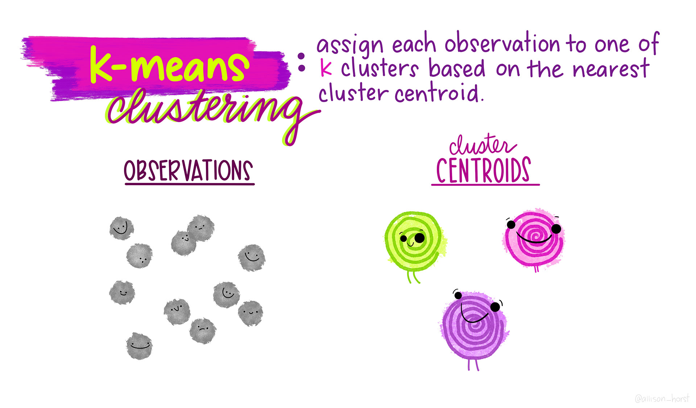
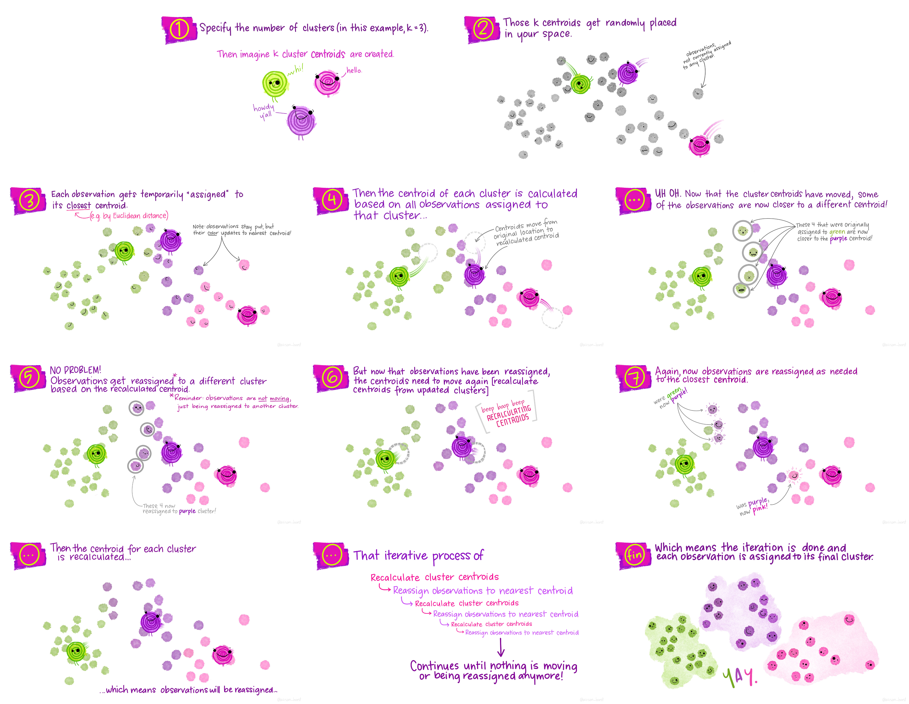

# What is Machine Learning?

```{r Packages, message = FALSE, results = FALSE}
# define packages we need
packages <- c("tidyverse", "palmerpenguins", "stats", "factoextra", "cluster", "formatR", "class", "modelsummary",
              "kableExtra", "vembedr", "gridExtra", "corrr", "ggcorrplot", "FactoMineR", "rpart", "rpart.plot")

# install packages  
#install.packages(packages)

# load packages
lapply(packages, require, character.only = TRUE, quietly = TRUE)
```

```{r Setup, include = FALSE, echo = FALSE}
knitr::opts_chunk$set(echo = TRUE)
options(yaml.eval.expr = TRUE)
knitr::opts_chunk$set(tidy.opts = list(width.cutoff = 75), tidy = TRUE)
```

```{r Introduction Video, echo = FALSE}
vembedr::embed_url("https://youtu.be/kN_sY1WiAjg")
```

Machine learning (ML) broadly describes the process of teaching computers to learn information. It is widely used in computer science, neuroscience, and data science to train "machines" (e.g., algorithms, models) to learn about information and make predictions or classifications based on that learning. Machine learning is a subset of artificial intelligence (AI), and it has grown in popularity during the recent AI boom. While AI describes the general development of computers that can mimic cognitive function, machine learning is more specific, using algorithms and large amounts of data to make informed decisions for specific tasks. 

Machine learning has become especially popular for researchers in psychology and neuroscience. Thanks to huge increases in computing power and access to datasets with thousands or millions of observations, psychologists have seen great success in applying ML methods to gather insights about human behavior and cognition. ML models can reduce time, effort, and error costs and can be applied flexibly across projects and datasets, including behavioral, survey, and neuroimaging data. 

The goal of this tutorial is to introduce a variety of machine learning methods that can be applied to psychological data. We will examine the differences between unsupervised and supervised models and in which contexts they are best applied. This tutorial will also touch on model evaluation and comparison, and unpack how to determine certain parameters given your data. This is by no means an exhaustive list of all approaches - these are meant to serve as introductory examples and methods that can be employed specifically in the R programming language. A majority of more complex ML approaches are supported in Python using libraries like `PyTorch`, `TensorFlow`, and `Keras`, and these are more typically what you might see in other ML tutorials. 

```{r Penguins, echo=FALSE, out.width = '200px', out.extra='style="float:left; padding:40px"'}
knitr::include_graphics("./images/penguin-hex.png")
```
<br>
This tutorial is intended to be an introduction to machine learning with R, but you should have some familiarity with scripting and R before starting this tutorial. This tutorial will also discuss reasons for using machine learning alongside more "traditional" data analysis and visualization techniques, and leave room for future directions on applying machine learning tools to relevant psychological and neural datasets.

We will use one publicly available dataset throughout the tutorial, accessible through the `palmerpenguins` R package. This is similar to the native `iris` dataset in R but serves as a fresh and similarly simple dataset. 

<br>

Note: Artwork by [@allison_horst](https://twitter.com/allison_horst). All images included in this tutorial are available for open use under the Creative Commons Attribution 4.0 International License.

```{r Colors & Formatting}
# set colors
colors <- c("#ff6800","#d74fd0","#007176")
# set custom plot formatting
plot.format <- list(theme_classic(), scale_color_manual(values = colors), 
                    scale_fill_manual(values = colors))
```

# Dataset

```{r Dataset Exploration Video, echo = FALSE}
vembedr::embed_url("https://youtu.be/XpQfJ41c8-w")
```

The palmer penguins dataset was created by Allison Horst, and features data from penguins. The data from these penguins was originally collected by researchers at the Palmer Long-Term Ecological Research Station in Antarctica. There are three different species of penguin in this dataset collected from three islands in the Palmer Archipelago, Antarctica. For the sake of simplicity, we will be working with the `penguins` dataset, rather than the `penguins_raw` dataset.

{width=50%}

**What data is contained in the dataset?**

- `species` - penguin species
- `island` - island the penguin lived on
- `bill_length_mm` - length of penguin bill in millimeters 
- `bill_depth_mm` - depth of penguin bill in millimeters
- `flipper_length_mm` - length of flippers in millimeters
- `body_mass_g` - mass of penguin in grams
- `sex` - sex of penguin, either male or female
- `year` - year data was collected

**A note about bill length vs. bill depth:**

{width=50%}

## Explore data

Before we start with our ML models, let's take a moment to explore the data we're working with. 

```{r Load Data}
# load data
df <- palmerpenguins::penguins
# examine data
head(df)
datasummary_skim(df,
                 type = 'categorical')
datasummary_skim(df,
                 type = "numeric")
# remove penguins with missing data
df <- na.omit(df)
# correlation tables
datasummary_correlation(df[,c("bill_length_mm", "bill_depth_mm", "flipper_length_mm", "body_mass_g")])
```

```{r Data Visualizations, warning=FALSE}
# frequency of body mass 
ggplot(data = df, aes(x = body_mass_g, color = species, group = species, fill = species)) + 
  geom_histogram(alpha = 0.7) +
  labs(x = "body mass (g)", y = "frequency", title = "Frequency of Body Masses by Species") +
  plot.format

# bill length vs. bill depth
ggplot(data = df, aes(x = bill_length_mm, y = bill_depth_mm, color = species, group = species)) +
  geom_point() +
  geom_smooth(method = lm, se = F) +
  labs(x = "bill length (mm)", y = "bill depth (mm)", title = "Penguin Bill Length and Bill Depth by Species") +
  plot.format

# body mass vs. flipper length
ggplot(data = df, aes(x = body_mass_g, y = flipper_length_mm, color = species, group = species)) +
  geom_point() +
  geom_smooth(method = lm, se = F) +
  labs(x = "body mass (g)", y = "flipper length (mm)", title = "Penguin Body Mass and Flipper Length by Species") +
  plot.format

# just for fun radar plot
library(fmsb)
# create a function to normalize the predictors
nor <- function(x) { (x - min(x))/(max(x) - min(x)) }
# normalize the predictor columns
penguin.norm <- as.data.frame(lapply(df[,c("body_mass_g", "flipper_length_mm", "bill_length_mm", "bill_depth_mm")], nor))
penguin.norm <- cbind(df$species, penguin.norm)
names(penguin.norm)[1] <- 'species'
# get average data for each penguin species
penguins <- penguin.norm %>%
  group_by(species) %>%
  summarize(`body mass` = mean(body_mass_g),
            `flipper\nlength` = mean(flipper_length_mm),
            `bill length` = mean(bill_length_mm),
            `bill\ndepth` = mean(bill_depth_mm))
penguins$species <- as.character(penguins$species)
names <- penguins$species
penguins <- penguins[,-1]
rownames(penguins) <- names
penguins <- rbind(rep(1,1), rep(0,1), penguins)

radarchart(penguins, pcol = colors, plwd = 3, plty = 1, cglcol = "grey")
```

Now that we've examined the data that we're working with, let's outline how we can leverage machine learning to analyze this data. 

A common area of investigation in psychology are individual difference measures. Machine learning can be particularly useful to group data into groups, revealing underlying structures or similarities that may not be apparent to human raters. With the palmer penguin data, we can use the four data points for each penguin (bill length, bill depth, flipper length, and body mass) and their species grouping to develop a model that can be applied to new data (supervised). We can see how well a model can classify penguin data into species groups when we remove the species labels (unsupervised). 

# Supervised Learning

```{r Supervised Learning Video, echo = FALSE}
vembedr::embed_url("https://youtu.be/l-bcXqxUkM8")
```

Supervised learning is a machine learning technique for data that contains labeled examples, such that each data point contains features and an associated label. The goal of supervised learning is to map features to labels based on example data and apply that mapping to classify new data. In the case of the palmer penguin data, our features include bill length, bill depth, flipper length, and body mass, and our labels are penguin species names. 

## K-Nearest Neighbors

K-nearest neighbors (k-NN) is a technique used to classify data into specified classes. Let's start by using the k-NN algorithm to try to classify our penguin species based on two data dimensions, bill length and bill depth. 

```{r KNN Setup}
# set seed so we get the same results every time
set.seed(123)
# generate a random number that is 80% of total number of rows in the dataset; this will be our training set
ran <- sample(1:nrow(df), 0.8 * nrow(df))
# create a function to normalize the predictors
nor <- function(x) { (x - min(x))/(max(x) - min(x)) }
# normalize the predictor columns
df.norm <- as.data.frame(lapply(df[,c("bill_length_mm", "bill_depth_mm")], nor))
# check that normalizing worked
summary(df.norm)
```

```{r KNN Model, warning = FALSE}
# extract training set
df.train <- df.norm[ran,]
# extract testing set
df.test <- df.norm[-ran,]
# extract species name to be used as classification argument in knn
df.category <- df[ran, 1]

# run knn function; let's start with 3 neighbors and see how accurate that is 
pred <- knn(train = df.train, test = df.test, cl = df.category$species, k = 3)

# show proportion correctly classified
accuracy <- 100 * sum(df.category$species == pred)/nrow(df.category)
print(paste0("KNN classification accuracy = ", round(accuracy, digits = 2), "%", sep = ""))

# yikes, not great
# let's try again with different numbers of neighbors
pred <- knn(train = df.train, test = df.test, cl = df.category$species, k = 10)
accuracy <- 100 * sum(df.category$species == pred)/nrow(df.category)
print(paste0("KNN classification accuracy = ", round(accuracy, digits = 2), "%", sep = ""))
```

### Example

1. Use the KNN algorithm to classify penguin species based on flipper length and body mass. Try a range of neighbors when employing the model. [Click for solution.](LINK TO knn-1.R FOR SOLUTION)

2. Use the KNN algorithm to classify penguin species based on all data dimensions. Try a range of neighbors when employing the model. [Click for solution.](LINK TO knn-2.R FOR SOLUTION)

## Classification / Decision Trees

Classification trees (or decision trees) are another supervised learning technique to draw conclusions about a set of data observations. Classification trees are tree models where the target variable (in our case, the species variable) can take on a set of discrete values (e.g., Chinstrap, Gentoo, Adelie). We can train a decision tree model on a selection of our data and then apply it to a set of test data, and see how accurately the decision tree can categorize penguins with their correct species label.

```{r Classification Trees}
set.seed(123)
# shuffle rows to ensure we take a random sample for training and testing sets
shuffle.index <- sample(1:nrow(df))
shuffle.df <- df[shuffle.index, ]

# we need to create a testing and training set, 80% trains the model
# data = dataset to train model, size = percent split, train = T creates train set otherwise test
create_train_set <- function(data, size = 0.8, train = TRUE) {
  n_row = nrow(data)
  total_row = size * n_row
  train_sample <- 1:total_row
  if (train == TRUE) {
    return (data[train_sample, ]) 
  } else {
    return (data[-train_sample, ])
  }
}
# make sure to use the new shuffled data frame!
df.train <- create_train_set(shuffle.df, 0.8, train = T)
df.test <- create_train_set(shuffle.df, 0.8, train = F)

# fit decision tree model
fit <- rpart(species ~ ., data = df.train, method = "class")
rpart.plot(fit, extra = 106)

# now let's predict on the test dataset
predicted.test <- predict(fit, df.test, type = 'class')
table_predicted <- table(df.test$species, predicted.test)
table_predicted

# it did pretty well! it correctly predicted 26 Adelie penguins but incorrectly classified 2 Chinstrap penguins as Adelie penguins

# measure performance
accuracy <- sum(diag(table_predicted)) / sum(table_predicted)
accuracy <- accuracy * 100
print(paste0("Decision tree classification accuracy = ", round(accuracy, digits = 2), "%", sep = ""))
```

### Example

What happens to the decision tree if you remove **island name** and **flipper length** from the data frame. Does it change the model accuracy? What does that tell you about the removed data? [Click for solution.](LINK TO dectree.R FOR SOLUTION)

***

# Unsupervised Learning

```{r Unsupervised Learning Video, echo = FALSE}
vembedr::embed_url("https://youtu.be/UyZ83ra-lS4")
```

Unsupervised machine learning is a technique for data that does not contained labeled examples. There are two goals to unsupervised machine learning: clustering and dimensionality reduction. You will learn how to use two techniques - K-means clustering will help you cluster data and Principal Components Analysis will help you reduce dimensionality within the data. 

First, we need to **remove labels** from our dataset. In unsupervised machine learning, there are no labels provided alongside the data. Since we're working with a dataset that has labels already (see the supervised learning approaches above), let's remove the labels (species, island, sex) and see how well unsupervised models perform. 

```{r Remove Labels}
# pull only penguin measurements - bill length, bill depth, flipper length, body mass
df.ul <- df %>%
  select(bill_length_mm, bill_depth_mm, flipper_length_mm, body_mass_g)
```

## K-means clustering

K-means clustering is an unsupervised technique that assigns each observation to one of `k` clusters based on the nearest cluster centroid. We have to specify the number of clusters we might expect from the data (we can also do this iteratively to *find* the optimal number of clusters based on the data) - this is our `k`. 

{width=50%}

I find this series of visualizations to be really helpful in understanding the process of assigning observations to these clusters. 



In this example, we're going to try using a `k` of 3 as a hypothesized number of clusters for **species** and a `k` of 2 as a hypothesized number of clusters for penguin sex. For simplicity, we will be using only `flipper length` and `bill length` observations. K-means clustering can handle more than 2 dimensions of data, but to best outline how k-means clustering compares to the actual structure of the data, we will just use these two for now.

```{r K-Means Clustering}
# subset flipper length and bill length from unlabeled data frame
ul.subset <- df.ul %>%
  select(bill_length_mm, flipper_length_mm)

# let's visualize the data with species labels from our main data frame
ggplot(data = df, aes(x = bill_length_mm, y = flipper_length_mm, color = species, group = species)) +
  geom_point() +
  labs(x = "bill length (mm)", y = "flipper length (mm)", title = "Penguin Bill Length and Flipper Length by Species") +
  plot.format

# run k-means clustering for species (k = 3)
set.seed(123)
k3 <- stats::kmeans(ul.subset, 3, nstart = 25)
str(k3)
k3
fviz_cluster(k3, data = ul.subset) + theme_classic()

# let's visualize the data using sex labels
ggplot(data = df, aes(x = bill_length_mm, y = flipper_length_mm, color = sex, group = sex)) +
  geom_point() +
  labs(x = "bill length (mm)", y = "flipper length (mm)", title = "Penguin Bill Length and Flipper Length by Sex") +
  plot.format

# run k-means clustering for sex (k = 2)
set.seed(123)
k2 <- stats::kmeans(ul.subset, 2, nstart = 25)
str(k2)
k2
fviz_cluster(k2, data = ul.subset) + theme_classic()
```

How do we determine the "optimal" number of clusters based on our data? There are a few different methods we can use to find the optimal `k` to specify. This process can be somewhat subjective, but we can use three different methods to attempt to reach a consensus. Partitioning the data with k-means clustering aims to minimize the intra-cluster variation.

The first method is called the **Elbow Method** and aims to find a `k` that has the smallest within-cluster sum of squares (WSS). The total WSS measures how compact the clusters are. The Elbow Method examines total WSS as a function of the number of clusters such that adding another cluster doesn't improve the total WSS.

```{r Optimizing Clusters - WSS}
set.seed(123)
fviz_nbclust(ul.subset, kmeans, method = "wss")
```

We can also use a method called the **Average Silhouette Method** which measures the quality of a clustering. A high average silhouette width indicates good clustering. With this method, the optimal number for `k` is the one that maximizes the average silhouette over a range of possible values for `k`. 

```{r Optimizing Clusters - ASM}
set.seed(123)
fviz_nbclust(ul.subset, kmeans, method = "silhouette")
```

Finally, we can use a statistical method called the **Gap Statistic Method** which compares data against a null hypothesis. The gap statistic compares the total within intra-cluster variation for different values of `k` with their expected values under a null reference distribution of the data. The optimal cluster number is a value that maximizes the gap statistic and means that the clustering structure is far from the random uniform distribution of observations. 

```{r Optimizing Clusters - Gap Statistic}
set.seed(123)
gap_stat <- clusGap(ul.subset, FUN = kmeans, nstart = 25,
                    K.max = 10, B = 50)
fviz_gap_stat(gap_stat)
```

Ok so from these three methods, we have a mixture of suggestions. The Elbow Method suggests 4 clusters, the Silhouette Method suggests 2 clusters, and the Gap Statistic Method suggests 4 clusters. There is no clear consensus, but we can be relatively confident that using a `k` between 2 and 4 is likely optimal. Let's see how these different k values look with our data!

```{r KMC}
# calculate kmeans for 2, 3, and 4 centers
k2 <- kmeans(ul.subset, centers = 2, nstart = 25)
k3 <- kmeans(ul.subset, centers = 3, nstart = 25)
k4 <- kmeans(ul.subset, centers = 4, nstart = 25)
# define plots to compare
p1 <- fviz_cluster(k2, geom = "point", data = ul.subset) + ggtitle("k = 2") + theme_classic()
p2 <- fviz_cluster(k3, geom = "point", data = ul.subset) + ggtitle("k = 3") + theme_classic()
p3 <- fviz_cluster(k4, geom = "point", data = ul.subset) + ggtitle("k = 4") + theme_classic()
# plot together
grid.arrange(p1, p2, p3, nrow = 2)
```

### Example

Repeat k-means clustering using **bill depth** and **body mass** from the unlabeled data frame. Does it change the number of optimal clusters? [Click for solution.](LINK TO kmeans.R FOR SOLUTION)

## Principal Components Analysis

Principal Components Analysis (PCA) is a method to reduce dimensionality in a dataset using unsupervised machine learning models. We have four dimensions for each penguin in our dataset (bill length, bill depth, body mass, and flipper length), but as we discussed in k-means clustering, it's difficult to visualize all four of these dimensions together. Using PCA, we can transform the data into lower-dimensional space and collapse highly correlated variables together. We can then extract important information and visualize the data more easily. 

The first step we'll want to take for PCA is data normalization. We can use the same function we created in the supervised learning section. Then we need to compute a covariance matrix from the normalized data (using the `corrr` package). 

```{r PCA}
# normalize the unlabeled data frame
df.norm <- as.data.frame(lapply(df.ul, nor))
# compute correlation matrix
df.corr <- cor(df.norm)
# visualize correlation matrix
ggcorrplot(df.corr)
# conduct PCA
df.pca <- princomp(df.corr)
summary(df.pca)
# view loadings of first two components only
df.pca$loadings[,1:2]
# scree plot
fviz_eig(df.pca, addlabels = T, barfill = "deepskyblue3", barcolor = "deepskyblue3")
# biplot of attributes
fviz_pca_var(df.pca, col.var = "deepskyblue3")
```

### Example

Let's pretend that the penguin species variable is our only "label" variable. Try coding sex as a numeric variable (where male = 0 and female = 1) and re-run the PCA. What is similar? What's different? [Click for solution.](LINK TO pca.R FOR SOLUTION)

# Conclusion

```{r Conclusion Video, echo = FALSE}
vembedr::embed_url("https://youtu.be/syW85OVTUaM")
```

In this tutorial, you have learned how to apply both supervised and unsupervised machine learning models to an easily available dataset. These techniques include K-Nearest Neighbors clustering, Decision Trees, K-Means Clustering, and Principal Components Analysis. Using these relatively simple tools in a programming language that is popular among psychology and neuroscience researchers makes these machine learning techniques easily accessible and applicable to a variety of datasets, research projects, and topics. 

If you're interested in learning more about machine learning, or learning how to apply more advanced machine learning models to your data, there are a host of resources for machine learning in Python. Some useful introduction tutorials are linked below: 

- https://www.geeksforgeeks.org/introduction-machine-learning-using-python/#  
- https://github.com/amueller/introduction_to_ml_with_python 

Thanks for following along!

{width=50%}
