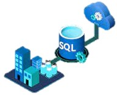
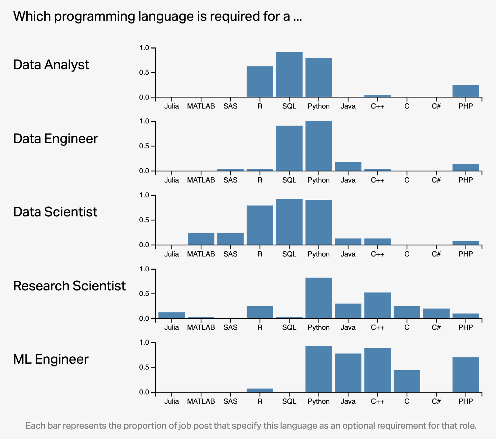
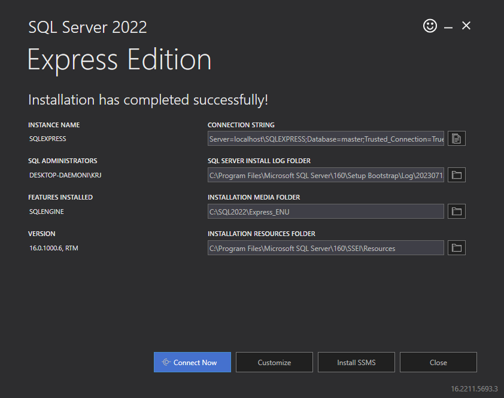
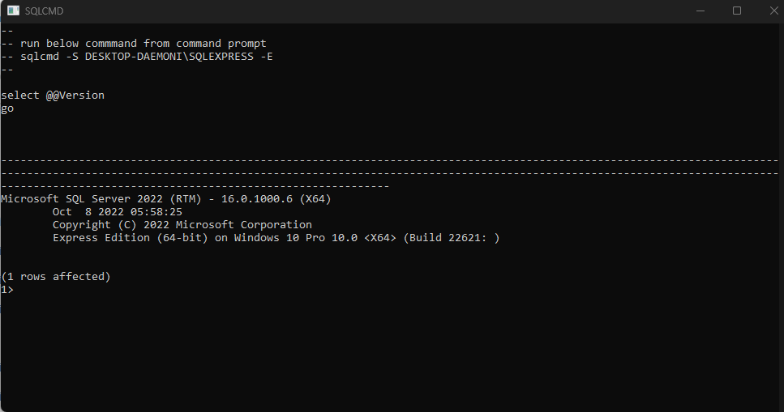
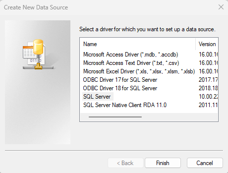
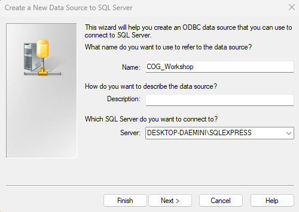

```{r setup, include=FALSE}
knitr::opts_chunk$set(echo = TRUE, error = FALSE)
```

# Introduction

## What is SQL?


Structured Language Query (SQL) is a programming language commonly used in data science to store large data sets. You use it much like you would use the language git to access Github. Both SQL and git allow data to be stored in a centralized place; often a remote server. Others are able to access and add to this data. You can store and call whole databases on GitHub. 



However, SQL has a built in language that allows you to directly interface with the data, rather than using a separate program like you would for GitHub. This language is one of the most common used in "industry" jobs that people get after leaving academia, such as data scientist or data engineer. This tutorial will be a basic introduction to SQL so that individuals who are interested in jobs outside of academia will have some additional experience relevant to these jobs. 

## What does SQL do?

SQL is primarily used to interface with very large databases. Unlike datasets in academic settings, many of the databases that companies work with are terabytes worth of data, and cannot simply be stored in a program like Excel or SPSS. SQL allows you to call certain pieces of the database that you are interested in without having to rake through tons of data. You can also use SQL to add or delete data from these databases.

###Regex example here

Beyond this, SQL can also be automatized by triggers. Companies can write scripts to automatically append data as it comes in, so that it does not need to be monitored and done by hand. This reduces the need to enter data, and effort can be geared towards data cleaning and other functions.

## Why is SQL important?

This isn't a programming language one would readily encounter in academia. Our datasets are not often big enough to justify using SQL. However, as we see in the image below, SQL is a big part of many data and tech jobs that we might pursue after competing our graduate degrees. It's pretty unlikely that you would be exposed to this programming language without occupying one of these positions or seeking it out yourself, so we hope this workshop exposes you to some of the basic functions and utility of SQL. It is not a difficult language to learn, so this workshop will provide a foundation for attendees to easily apply for something like an industry job interview.




## What is an SQL Server?

An SQL Server, also known as a relational database management system (RDBMS), is where the data that SQL accesses is stored. The data stored on these servers are often structured into tables similar to a spreadsheet. These SQL Servers tables can be *massive* and the SQL language offers a relatively quick means of retrieve, insert, update, and delete data in the database, but this is just one of the many reasons why SQL servers are used. SQL servers are designed to handle variably concurrent access requests from different users in an efficient **and** secure manner. A server administrator enforces rules as to who can modify and access what on the server. SQL Servers also feature different options for data backup and recovery and can allow users to perform calculations directly in the table without having to necessarily create a subset of data. 

# Setting Up a SQL Server

## How to Use SQL with SQL Server

There are multiple ways to use SQL. While we will not be covering how to use SQL Server is this workshop, in favor of languages you all might be familiar with, this seems to be one of the most common ways people use SQL. SQL Server is basically just a program specifically for SQL programming. It is also more secure than something like RSudio and Jupyter Notebooks, so if you are in a job where the data needs to be secure, you are more likely to encounter SQL Server. There are several steps to get SQL setup on your local computer.


1. Download the ODBC Driver, to be able to initalize other code: https://learn.microsoft.com/en-us/sql/connect/odbc/download-odbc-driver-for-sql-server?view=sql-server-ver16 - **make sure you download the correct version of this, either 32- or 64-bit for your computer.**

2. Download an SQL Server to use; this is the one I use, but there are many of them: https://www.microsoft.com/en-us/sql-server/sql-server-downloads - **scroll down and click 'Download now' under 'Express'**



3. Open SQL Server to configure your connection (follow the in-program instructions) - once you have configured, click **Connect Now** to get the server name and location on your computer. This should invoke a command line window to pop up. Your server name and location should be the second line. Mine in the screenshot is DESKTOP-DAEMONI\/SQLEXPRESS. You will need this in a moment! 



4. Open your ODBC Data Source program. Under 'System DSN', click the 'Add...' button. 


Highlight 'SQL Server', and then click 'Finish'.A new window will pop up. Under Name, name this something you will remember for later. And under Server, enter your server name and location from the command line window.


After this, you can click 'Finish', and it will test your connection for you. 

## How to Use SQL Server in R

5. Run the chunk of code below to load packages in R that can deal with SQL data and code

```{r, echo = FALSE}
install.packages(c("pacman"))
library(pacman)
pacman::p_load(DBI, sqldf, odbc, reader)
con <- dbConnect(
  odbc::odbc(), 
  "Katie_SQL"
  ) #make sure to insert the name you just input for your server name here
```

6. Connect to the SQL server with a code chunk that looks like this:
```{\sql, connection=con, output.var="world_dataframe"\}

```

### How to use SQL in Jupyter Notebooks
```{python}
pip install ipython-sql
pip install sqlalchemy
pip install pandas
```

## MySQL Database example data

Loading in data from something like a CSV can be difficult, so we are going to skip that and create our own database using SQL code. 

```{sql, connection=con}
CREATE TABLE  AGENTS (	
  AGENT_CODE CHAR(6) NOT NULL, 
	AGENT_NAME CHAR(40) NOT NULL, 
	WORKING_AREA CHAR(35) NOT NULL, 
	COMMISSION INT NOT NULL, 
	PHONE_NO CHAR(15) NOT NULL, 
	COUNTRY VARCHAR(25) NOT NULL,
	PRIMARY KEY (AGENT_CODE)
	 );
```
```{sql,connection=con}	 
CREATE TABLE  CUSTOMER (	
  CUST_CODE VARCHAR(6) NOT NULL PRIMARY KEY, 
	CUST_NAME VARCHAR(40) NOT NULL, 
	CUST_CITY CHAR(35), 
	WORKING_AREA VARCHAR(35) NOT NULL, 
	CUST_COUNTRY VARCHAR(20) NOT NULL, 
	GRADE INT, 
	OPENING_AMT INT NOT NULL, 
	RECEIVE_AMT INT NOT NULL, 
	PAYMENT_AMT INT NOT NULL, 
	OUTSTANDING_AMT INT NOT NULL, 
	PHONE_NO VARCHAR(17) NOT NULL, 
	AGENT_CODE CHAR(6) NOT NULL REFERENCES AGENTS
);   

```

```{sql, connection=con}

```

```{sql, connection=con}
INSERT INTO AGENTS VALUES ('A007', 'Ramasundar', 'Bangalore', '300', '077-25814763', '');
INSERT INTO AGENTS VALUES ('A003', 'Alex ', 'London', '800', '075-12458969', '');
INSERT INTO AGENTS VALUES ('A008', 'Alford', 'New York', '900', '044-25874365', '');
INSERT INTO AGENTS VALUES ('A011', 'Ravi Kumar', 'Bangalore', '400', '077-45625874', '');
INSERT INTO AGENTS VALUES ('A010', 'Santakumar', 'Chennai', '250', '007-22388644', '');
INSERT INTO AGENTS VALUES ('A012', 'Lucida', 'San Jose', '675', '044-52981425', '');
INSERT INTO AGENTS VALUES ('A005', 'Anderson', 'Brisbane', '550', '045-21447739', '');
INSERT INTO AGENTS VALUES ('A001', 'Subbarao', 'Bangalore', '450', '077-12346674', '');
INSERT INTO AGENTS VALUES ('A002', 'Mukesh', 'Mumbai', '200', '029-12358964', '');
INSERT INTO AGENTS VALUES ('A006', 'McDen', 'London', '750', '078-22255588', '');
INSERT INTO AGENTS VALUES ('A004', 'Ivan', 'Torento', '400', '008-22544166', '');
INSERT INTO AGENTS VALUES ('A009', 'Benjamin', 'Hampshair', '950', '008-22536178', '');
```

```{sql, connection=con}
INSERT INTO CUSTOMER VALUES ('C00013', 'Holmes', 'London', 'London', 'UK', '2', '6000.00', '5000.00', '7000.00', '4000.00', 'BBBBBBB', 'A003');
INSERT INTO CUSTOMER VALUES ('C00001', 'Micheal', 'New York', 'New York', 'USA', '2', '3000.00', '5000.00', '2000.00', '6000.00', 'CCCCCCC', 'A008');
INSERT INTO CUSTOMER VALUES ('C00020', 'Albert', 'New York', 'New York', 'USA', '3', '5000.00', '7000.00', '6000.00', '6000.00', 'BBBBSBB', 'A008');
INSERT INTO CUSTOMER VALUES ('C00025', 'Ravindran', 'Bangalore', 'Bangalore', 'India', '2', '5000.00', '7000.00', '4000.00', '8000.00', 'AVAVAVA', 'A011');
INSERT INTO CUSTOMER VALUES ('C00024', 'Cook', 'London', 'London', 'UK', '2', '4000.00', '9000.00', '7000.00', '6000.00', 'FSDDSDF', 'A006');
INSERT INTO CUSTOMER VALUES ('C00015', 'Stuart', 'London', 'London', 'UK', '1', '6000.00', '8000.00', '3000.00', '11000.00', 'GFSGERS', 'A003');
INSERT INTO CUSTOMER VALUES ('C00002', 'Bolt', 'New York', 'New York', 'USA', '3', '5000.00', '7000.00', '9000.00', '3000.00', 'DDNRDRH', 'A008');
INSERT INTO CUSTOMER VALUES ('C00018', 'Fleming', 'Brisban', 'Brisban', 'Australia', '2', '7000.00', '7000.00', '9000.00', '5000.00', 'NHBGVFC', 'A005');
INSERT INTO CUSTOMER VALUES ('C00021', 'Jacks', 'Brisban', 'Brisban', 'Australia', '1', '7000.00', '7000.00', '7000.00', '7000.00', 'WERTGDF', 'A005');
INSERT INTO CUSTOMER VALUES ('C00019', 'Yearannaidu', 'Chennai', 'Chennai', 'India', '1', '8000.00', '7000.00', '7000.00', '8000.00', 'ZZZZBFV', 'A010');
INSERT INTO CUSTOMER VALUES ('C00005', 'Sasikant', 'Mumbai', 'Mumbai', 'India', '1', '7000.00', '11000.00', '7000.00', '11000.00', '147-25896312', 'A002');
INSERT INTO CUSTOMER VALUES ('C00007', 'Ramanathan', 'Chennai', 'Chennai', 'India', '1', '7000.00', '11000.00', '9000.00', '9000.00', 'GHRDWSD', 'A010');
INSERT INTO CUSTOMER VALUES ('C00022', 'Avinash', 'Mumbai', 'Mumbai', 'India', '2', '7000.00', '11000.00', '9000.00', '9000.00', '113-12345678','A002');
INSERT INTO CUSTOMER VALUES ('C00004', 'Winston', 'Brisban', 'Brisban', 'Australia', '1', '5000.00', '8000.00', '7000.00', '6000.00', 'AAAAAAA', 'A005');
INSERT INTO CUSTOMER VALUES ('C00023', 'Karl', 'London', 'London', 'UK', '0', '4000.00', '6000.00', '7000.00', '3000.00', 'AAAABAA', 'A006');
INSERT INTO CUSTOMER VALUES ('C00006', 'Shilton', 'Torento', 'Torento', 'Canada', '1', '10000.00', '7000.00', '6000.00', '11000.00', 'DDDDDDD', 'A004');
INSERT INTO CUSTOMER VALUES ('C00010', 'Charles', 'Hampshair', 'Hampshair', 'UK', '3', '6000.00', '4000.00', '5000.00', '5000.00', 'MMMMMMM', 'A009');
INSERT INTO CUSTOMER VALUES ('C00017', 'Srinivas', 'Bangalore', 'Bangalore', 'India', '2', '8000.00', '4000.00', '3000.00', '9000.00', 'AAAAAAB', 'A007');
INSERT INTO CUSTOMER VALUES ('C00012', 'Steven', 'San Jose', 'San Jose', 'USA', '1', '5000.00', '7000.00', '9000.00', '3000.00', 'KRFYGJK', 'A012');
INSERT INTO CUSTOMER VALUES ('C00008', 'Karolina', 'Torento', 'Torento', 'Canada', '1', '7000.00', '7000.00', '9000.00', '5000.00', 'HJKORED', 'A004');
INSERT INTO CUSTOMER VALUES ('C00003', 'Martin', 'Torento', 'Torento', 'Canada', '2', '8000.00', '7000.00', '7000.00', '8000.00', 'MJYURFD', 'A004');
INSERT INTO CUSTOMER VALUES ('C00009', 'Ramesh', 'Mumbai', 'Mumbai', 'India', '3', '8000.00', '7000.00', '3000.00', '12000.00', 'Phone No', 'A002');
INSERT INTO CUSTOMER VALUES ('C00014', 'Rangarappa', 'Bangalore', 'Bangalore', 'India', '2', '8000.00', '11000.00', '7000.00', '12000.00', 'AAAATGF', 'A001');
INSERT INTO CUSTOMER VALUES ('C00016', 'Venkatpati', 'Bangalore', 'Bangalore', 'India', '2', '8000.00', '11000.00', '7000.00', '12000.00', 'JRTVFDD', 'A007');
INSERT INTO CUSTOMER VALUES ('C00011', 'Sundariya', 'Chennai', 'Chennai', 'India', '3', '7000.00', '11000.00', '7000.00', '11000.00', 'PPHGRTS', 'A010');


```


# Key Functions


## SELECT


## 

## Other types of common functions


# Integrations & Analyses

## Using SQL in R

## Regression with Python

## Machine Learning with Python

# Advanced Functions

