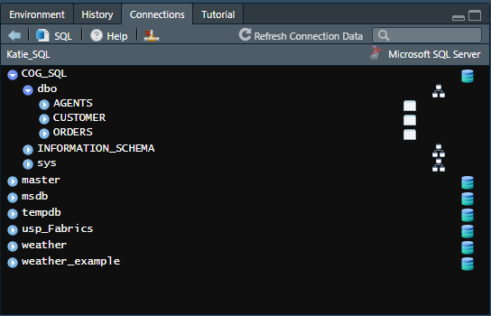
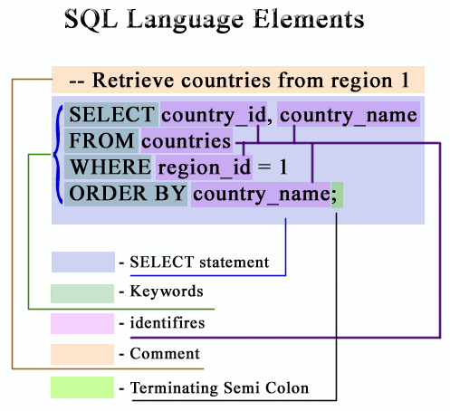
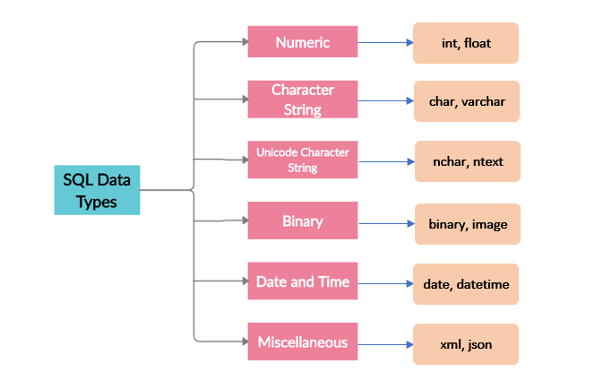

```{r setup, include=FALSE}
knitr::opts_chunk$set(attr.output = "style=\"max-height: 100px;\"", echo = TRUE, error = FALSE)
```

```{r klippy, echo=FALSE, include=TRUE}
#remotes::install_github("rlesur/klippy")
#library(klippy)
klippy::klippy(c('r', 'python'))
```

# Introduction

## What is SQL?

{width=25%}

Structured Language Query (SQL) is a programming language commonly used in data science to store large data sets. You use it much like you would use the language git to access Github. Both SQL and git allow data to be stored in a centralized place; often a remote server. Others are able to access and add to this data. You can store and call whole databases on GitHub. 


However, SQL has a built in language that allows you to directly interface with the data, rather than using a separate program like you would for GitHub. This language is one of the most common used in "industry" jobs that people get after leaving academia, such as data scientist or data engineer. This tutorial will be a basic introduction to SQL so that individuals who are interested in jobs outside of academia will have some additional experience relevant to these jobs. 

## What does SQL do?

SQL is primarily used to interface with very large databases. Unlike datasets in academic settings, many of the databases that companies work with are terabytes worth of data, and cannot simply be stored in a program like Excel or SPSS. SQL allows you to call certain pieces of the database that you are interested in without having to rake through tons of data. You can also use SQL to add or delete data from these databases.

Beyond this, SQL can also be automatized by triggers. Companies can write scripts to automatically append data as it comes in, so that it does not need to be monitored and done by hand. This reduces the need to enter data, and effort can be geared towards data cleaning and other functions.

## Why is SQL important?

This isn't a programming language one would readily encounter in academia. Our datasets are not often big enough to justify using SQL. However, as we see in the image below, SQL is a big part of many data and tech jobs that we might pursue after competing our graduate degrees. It's pretty unlikely that you would be exposed to this programming language without occupying one of these positions or seeking it out yourself, so we hope this workshop exposes you to some of the basic functions and utility of SQL. It is not a difficult language to learn, so this workshop will provide a foundation for attendees to easily apply for something like an industry job interview.


## What is a SQL Server?

An SQL Server, also known as a relational database management system (RDBMS), is where the data that SQL accesses is stored. The data stored on these servers are often structured into tables similar to a spreadsheet. These SQL Servers tables can be *massive* and the SQL language offers a relatively quick means of retrieve, insert, update, and delete data in the database, but this is just one of the many reasons why SQL servers are used. SQL servers are designed to handle variably concurrent access requests from different users in an efficient **and** secure manner. A server administrator enforces rules as to who can modify and access what on the server. SQL Servers also feature different options for data backup and recovery and can allow users to perform calculations directly in the table without having to necessarily create a subset of data. 

# Setting Up a SQL Server

## How to Use SQL with SQL Server

There are multiple ways to use SQL. While we will not be covering how to extensively use SQL Server is this workshop, in favor of languages you all might be familiar with, this seems to be one of the most common ways people use SQL. SQL Server is basically just a program specifically for SQL programming. It is also more secure than something like RSudio and Jupyter Notebooks, so if you are in a job where the data needs to be secure, you are more likely to encounter SQL Server. There are several steps to get **MS SQL** setup on your local computer.


1. Download and install the ODBC Driver, to be able to initialize other code: https://learn.microsoft.com/en-us/sql/connect/odbc/download-odbc-driver-for-sql-server?view=sql-server-ver16 - **make sure you download the correct version of this, either 32- or 64-bit, for your computer. ** The 64-bit version has (x64) after it's name and the 32-bit version has (x86) after it's name (which we know is kind of confusing!).

2. Download an SQL Server to use; this is the one I use, but there are many of them: https://www.microsoft.com/en-us/sql-server/sql-server-downloads - **scroll down and click 'Download now' under 'Express'**

3. Open SQL Server to configure your connection (choose the basic option and follow the subsequent in-program instructions) - once you have configured, click **Connect Now** to get the server name and location on your computer. 

{width=50%}

This should invoke a command line window to pop up. Your server name and location should be the second line. Mine in the screenshot is DESKTOP-DAEMONI\/SQLEXPRESS. You will need this in a moment! 


4. Open the ODBC Data Source program that you installed during Step 1. In some cases you may have both so make sure you are opening the correct version of this, either 32- or 64-bit, for your computer. Under the 'System DSN' tab, click the 'Add...' button. 


Highlight 'SQL Server', and then click 'Finish'.A new window will pop up. Under Name, name this something you will remember for later. And under Server, enter your server name and location from the command line window.


After this, you can click 'Finish', then select "Test data Source ...". It will ensure that your connection is established and will print a message stating so if it is. If your connection has been established, click "OK".

## How to Use SQL Server in R

Now, let's use our newly downloaded MS SQL server to set up in R!

Run the chunk of code below to load packages in R that can deal with SQL data and code:

```{r, error=FALSE, eval=FALSE, warning=FALSE,class.source='klippy'}
install.packages(c("pacman"))
library(pacman)
pacman::p_load(DBI, odbc, reader)
```

```{r, error=FALSE,warning=FALSE}
con_r <- DBI::dbConnect(
  odbc::odbc(), 
  "Katie_SQL"
  ) #make sure to insert the name you just input for your server name here
```

Connect to the MS SQL server, include a code chunk that looks like this on your RMarkdown file:

`{sql, connection=con_r, output.var="world_dataframe"}`

## How to use SQL in Jupyter Notebooks

Next, let's do the same for those who want to follow along in Jupyter Notebooks.

I am running this in RMarkdown so I have to initialize a Python kernel - skip this if you are directly using Jupyter Notebooks!

```{r, error=FALSE,eval=FALSE, warning=FALSE}
install.packages("reticulate") #this is for using Python in R - very useful and neat!
library(reticulate)
py_install("pandas")
py_install("pyodbc") 
```

Now we have to set the connection in Python with the pyodbc library; there are a few more steps to using SQL in Python code than in R, including setting up a cursor to call the SQL code
```{python, error=FALSE,eval=FALSE, warning=FALSE}
import pyodbc 
con_py = pyodbc.connect('DRIVER={SQL Server};SERVER=WJPMITCHELL3\SQLEXPRESS01;Trusted_Connection=yes;') #Please note that this is slightly different from how we initialized the connection in R!
cursor = con_py.cursor()
#for any line of code, you have to filter it through this cursor function, e.g.:
cursor.execute("ALTER TABLE associates " +
               "ADD fullName VARCHAR(20)")
```

## SQL Database example data

Yay! We are all set up to wrangle data in either RStudio or Python.

Loading in data from something like a CSV can be difficult, so we are going to skip that and create our own database using SQL code. Note that SQL syntax is slightly different between the different servers (i.e. MySQL and MS SQL). We are coding in MS SQL, so some of this code may not work if you were to use something like MySQL.

In addition, I find using SQL in R a lot easier, so I am going to stick with that. However, if you want to use Jupyter Notebooks, feel free to follow along and try to run this code within the cursor.execute() function!

First, we add a new database and select it to be used for our code:

```{sql, Create Database, connection=con_r, error=FALSE,eval=FALSE, warning=FALSE}
CREATE DATABASE COG_SQL;
```


```{sql, connection=con_r, error=FALSE, warning=FALSE}
USE COG_SQL;
```
Here, we need to create empty tables to insert data into (think of how you would need to create a dataframe in R to put data into!):
```{sql, connection=con_r, error=FALSE,eval=FALSE, warning=FALSE}
CREATE TABLE  AGENTS (	
  AGENT_CODE CHAR(6) NOT NULL PRIMARY KEY, 
	AGENT_NAME CHAR(40) NOT NULL, 
	WORKING_AREA CHAR(35) NOT NULL, 
	COMMISSION INT NOT NULL, 
	PHONE_NO CHAR(15) NOT NULL, 
	COUNTRY VARCHAR(25) NOT NULL,
	 );
```

```{sql, connection=con_r, error=FALSE,eval=FALSE, warning=FALSE}
CREATE TABLE  CUSTOMER (	
  CUST_CODE VARCHAR(6) NOT NULL PRIMARY KEY, 
	CUST_NAME VARCHAR(40) NOT NULL, 
	CUST_CITY CHAR(35), 
	WORKING_AREA VARCHAR(35) NOT NULL, 
	CUST_COUNTRY VARCHAR(20) NOT NULL, 
	GRADE INT, 
	OPENING_AMT INT NOT NULL, 
	RECEIVE_AMT INT NOT NULL, 
	PAYMENT_AMT INT NOT NULL, 
	OUTSTANDING_AMT INT NOT NULL, 
	PHONE_NO VARCHAR(17) NOT NULL, 
	AGENT_CODE CHAR(6) NOT NULL REFERENCES AGENTS
);   
```

```{sql, connection=con_r, error=FALSE,eval=FALSE, warning=FALSE}
CREATE TABLE  ORDERS
   (
  ORD_NUM INT NOT NULL PRIMARY KEY, 
	ORD_AMOUNT INT NOT NULL, 
	ADVANCE_AMOUNT INT NOT NULL, 
	ORD_DATE DATE NOT NULL, 
	CUST_CODE VARCHAR(6) NOT NULL REFERENCES CUSTOMER, 
	AGENT_CODE CHAR(6) NOT NULL REFERENCES AGENTS, 
	ORD_DESCRIPTION VARCHAR(60) NOT NULL
   );
```

Now, we can insert our fake data into the tables:
```{sql, connection=con_r, error=FALSE,eval=FALSE, warning=FALSE}
INSERT INTO AGENTS VALUES ('A007', 'Ramasundar', 'Bangalore', 0.15, '077-25814763', '');
INSERT INTO AGENTS VALUES ('A003', 'Alex ', 'London', 0.13, '075-12458969', '');
INSERT INTO AGENTS VALUES ('A008', 'Alford', 'New York', 0.12, '044-25874365', '');
INSERT INTO AGENTS VALUES ('A011', 'Ravi Kumar', 'Bangalore', 0.15, '077-45625874', '');
INSERT INTO AGENTS VALUES ('A010', 'Santakumar', 'Chennai', 0.14, '007-22388644', '');
INSERT INTO AGENTS VALUES ('A012', 'Lucida', 'San Jose', 0.12, '044-52981425', '');
INSERT INTO AGENTS VALUES ('A005', 'Anderson', 'Brisban', 0.13, '045-21447739', '');
INSERT INTO AGENTS VALUES ('A001', 'Subbarao', 'Bangalore', 0.14, '077-12346674', '');
INSERT INTO AGENTS VALUES ('A002', 'Mukesh', 'Mumbai', 0.11, '029-12358964', '');
INSERT INTO AGENTS VALUES ('A006', 'McDen', 'London', 0.15, '078-22255588', '');
INSERT INTO AGENTS VALUES ('A004', 'Ivan', 'Torento', 0.15, '008-22544166', '');
INSERT INTO AGENTS VALUES ('A009', 'Benjamin', 'Hampshair', 0.11, '008-22536178', '');
```

```{sql, connection=con_r, error=FALSE,eval=FALSE, warning=FALSE,attr.output = "style=\"max-height: 150px;\""}
INSERT INTO CUSTOMER VALUES ('C00013', 'Holmes', 'London', 'London', 'UK', '2', 6000.00, 5000.00, 7000.00, 4000.00, 'BBBBBBB', 'A003');
INSERT INTO CUSTOMER VALUES ('C00001', 'Micheal', 'New York', 'New York', 'USA', '2', 3000.00, 5000.00, 2000.00, 6000.00, 'CCCCCCC', 'A008');
INSERT INTO CUSTOMER VALUES ('C00020', 'Albert', 'New York', 'New York', 'USA', '3', 5000.00, 7000.00, 6000.00, 6000.00, 'BBBBSBB', 'A008');
INSERT INTO CUSTOMER VALUES ('C00025', 'Ravindran', 'Bangalore', 'Bangalore', 'India', '2', 5000.00, 7000.00, 4000.00, 8000.00, 'AVAVAVA', 'A011');
INSERT INTO CUSTOMER VALUES ('C00024', 'Cook', 'London', 'London', 'UK', '2', 4000.00, 9000.00, 7000.00, 6000.00, 'FSDDSDF', 'A006');
INSERT INTO CUSTOMER VALUES ('C00015', 'Stuart', 'London', 'London', 'UK', '1', 6000.00, 8000.00, 3000.00, 11000.00, 'GFSGERS', 'A003');
INSERT INTO CUSTOMER VALUES ('C00002', 'Bolt', 'New York', 'New York', 'USA', '3', 5000.00, 7000.00, 9000.00, 3000.00, 'DDNRDRH', 'A008');
INSERT INTO CUSTOMER VALUES ('C00018', 'Fleming', 'Brisban', 'Brisban', 'Australia', '2', 7000.00, 7000.00, 9000.00, 5000.00, 'NHBGVFC', 'A005');
INSERT INTO CUSTOMER VALUES ('C00021', 'Jacks', 'Brisban', 'Brisban', 'Australia', '1', 7000.00, 7000.00, 7000.00, 7000.00, 'WERTGDF', 'A005');
INSERT INTO CUSTOMER VALUES ('C00019', 'Yearannaidu', 'Chennai', 'Chennai', 'India', '1', 8000.00, 7000.00, 7000.00, 8000.00, 'ZZZZBFV', 'A010');
INSERT INTO CUSTOMER VALUES ('C00005', 'Sasikant', 'Mumbai', 'Mumbai', 'India', '1', 7000.00, 11000.00, 7000.00, 11000.00, '147-25896312', 'A002');
INSERT INTO CUSTOMER VALUES ('C00007', 'Ramanathan', 'Chennai', 'Chennai', 'India', '1', 7000.00, 11000.00, 9000.00, 9000.00, 'GHRDWSD', 'A010');
INSERT INTO CUSTOMER VALUES ('C00022', 'Avinash', 'Mumbai', 'Mumbai', 'India', '2', 7000.00, 11000.00, 9000.00, 9000.00, '113-12345678','A002');
INSERT INTO CUSTOMER VALUES ('C00004', 'Winston', 'Brisban', 'Brisban', 'Australia', '1', 5000.00, 8000.00, 7000.00, 6000.00, 'AAAAAAA', 'A005');
INSERT INTO CUSTOMER VALUES ('C00023', 'Karl', 'London', 'London', 'UK', '0', 4000.00, 6000.00, 7000.00, 3000.00, 'AAAABAA', 'A006');
INSERT INTO CUSTOMER VALUES ('C00006', 'Shilton', 'Torento', 'Torento', 'Canada', '1', 10000.00, 7000.00, 6000.00, 11000.00, 'DDDDDDD', 'A004');
INSERT INTO CUSTOMER VALUES ('C00010', 'Charles', 'Hampshair', 'Hampshair', 'UK', '3', 6000.00, 4000.00, 5000.00, 5000.00, 'MMMMMMM', 'A009');
INSERT INTO CUSTOMER VALUES ('C00017', 'Srinivas', 'Bangalore', 'Bangalore', 'India', '2', 8000.00, 4000.00, 3000.00, 9000.00, 'AAAAAAB', 'A007');
INSERT INTO CUSTOMER VALUES ('C00012', 'Steven', 'San Jose', 'San Jose', 'USA', '1', 5000.00, 7000.00, 9000.00, 3000.00, 'KRFYGJK', 'A012');
INSERT INTO CUSTOMER VALUES ('C00008', 'Karolina', 'Torento', 'Torento', 'Canada', '1', 7000.00, 7000.00, 9000.00, 5000.00, 'HJKORED', 'A004');
INSERT INTO CUSTOMER VALUES ('C00003', 'Martin', 'Torento', 'Torento', 'Canada', '2', 8000.00, 7000.00, 7000.00, 8000.00, 'MJYURFD', 'A004');
INSERT INTO CUSTOMER VALUES ('C00009', 'Ramesh', 'Mumbai', 'Mumbai', 'India', '3', 8000.00, 7000.00, 3000.00, 12000.00, 'Phone No', 'A002');
INSERT INTO CUSTOMER VALUES ('C00014', 'Rangarappa', 'Bangalore', 'Bangalore', 'India', '2', 8000.00, 11000.00, 7000.00, 12000.00, 'AAAATGF', 'A001');
INSERT INTO CUSTOMER VALUES ('C00016', 'Venkatpati', 'Bangalore', 'Bangalore', 'India', '2', 8000.00, 11000.00, 7000.00, 12000.00, 'JRTVFDD', 'A007');
INSERT INTO CUSTOMER VALUES ('C00011', 'Sundariya', 'Chennai', 'Chennai', 'India', '3', 7000.00, 11000.00, 7000.00, 11000.00, 'PPHGRTS', 'A010');
```

```{sql, connection=con_r,error=FALSE,eval=FALSE, warning=FALSE}
INSERT INTO ORDERS VALUES(200100, 1000.00, 600.00, '08/01/2008', 'C00013', 'A003', 'SOD');
INSERT INTO ORDERS VALUES(200110, 3000.00, 500.00, '04/15/2008', 'C00019', 'A010', 'SOD');
INSERT INTO ORDERS VALUES(200107, 4500.00, 900.00, '08/30/2008', 'C00007', 'A010', 'SOD');
INSERT INTO ORDERS VALUES(200112, 2000.00, 400.00, '05/30/2008', 'C00016', 'A007', 'SOD'); 
INSERT INTO ORDERS VALUES(200113, 4000.00, 600.00, '06/10/2008', 'C00022', 'A002', 'SOD');
INSERT INTO ORDERS VALUES(200102, 2000.00, 300.00, '05/25/2008', 'C00012', 'A012', 'SOD');
INSERT INTO ORDERS VALUES(200114, 3500.00, 2000.00, '08/15/2008', 'C00002', 'A008', 'SOD');
INSERT INTO ORDERS VALUES(200122, 2500.00, 400.00, '09/16/2008', 'C00003', 'A004', 'SOD');
INSERT INTO ORDERS VALUES(200118, 500.00, 100.00, '07/20/2008', 'C00023', 'A006', 'SOD');
INSERT INTO ORDERS VALUES(200119, 4000.00, 700.00, '09/16/2008', 'C00007', 'A010', 'SOD');
INSERT INTO ORDERS VALUES(200121, 1500.00, 600.00, '09/23/2008', 'C00008', 'A004', 'SOD');
INSERT INTO ORDERS VALUES(200130, 2500.00, 400.00, '07/30/2008', 'C00025', 'A011', 'SOD');
INSERT INTO ORDERS VALUES(200134, 4200.00, 1800.00, '09/25/2008', 'C00004', 'A005', 'SOD');
INSERT INTO ORDERS VALUES(200108, 4000.00, 600.00, '02/15/2008', 'C00008', 'A004', 'SOD');
INSERT INTO ORDERS VALUES(200103, 1500.00, 700.00, '05/15/2008', 'C00021', 'A005', 'SOD');
INSERT INTO ORDERS VALUES(200105, 2500.00, 500.00, '07/18/2008', 'C00025', 'A011', 'SOD');
INSERT INTO ORDERS VALUES(200109, 3500.00, 800.00, '07/30/2008', 'C00011', 'A010', 'SOD');
INSERT INTO ORDERS VALUES(200101, 3000.00, 1000.00, '07/15/2008', 'C00001', 'A008', 'SOD');
INSERT INTO ORDERS VALUES(200111, 1000.00, 300.00, '07/10/2008', 'C00020', 'A008', 'SOD');
INSERT INTO ORDERS VALUES(200104, 1500.00, 500.00, '03/13/2008', 'C00006', 'A004', 'SOD');
INSERT INTO ORDERS VALUES(200106, 2500.00, 700.00, '04/20/2008', 'C00005', 'A002', 'SOD');
INSERT INTO ORDERS VALUES(200125, 2000.00, 600.00, '10/10/2008', 'C00018', 'A005', 'SOD');
INSERT INTO ORDERS VALUES(200117, 800.00, 200.00, '10/20/2008', 'C00014', 'A001', 'SOD');
INSERT INTO ORDERS VALUES(200123, 500.00, 100.00, '09/16/2008', 'C00022', 'A002', 'SOD');
INSERT INTO ORDERS VALUES(200120, 500.00, 100.00, '07/20/2008', 'C00009', 'A002', 'SOD');
INSERT INTO ORDERS VALUES(200116, 500.00, 100.00, '07/13/2008', 'C00010', 'A009', 'SOD');
INSERT INTO ORDERS VALUES(200124, 500.00, 100.00, '06/20/2008', 'C00017', 'A007', 'SOD'); 
INSERT INTO ORDERS VALUES(200126, 500.00, 100.00, '06/24/2008', 'C00022', 'A002', 'SOD');
INSERT INTO ORDERS VALUES(200129, 2500.00, 500.00, '07/20/2008', 'C00024', 'A006', 'SOD');
INSERT INTO ORDERS VALUES(200127, 2500.00, 400.00, '07/20/2008', 'C00015', 'A003', 'SOD');
INSERT INTO ORDERS VALUES(200128, 3500.00, 1500.00, '07/20/2008', 'C00009', 'A002', 'SOD');
INSERT INTO ORDERS VALUES(200135, 2000.00, 800.00, '09/16/2008', 'C00007', 'A010', 'SOD');
INSERT INTO ORDERS VALUES(200131, 900.00, 150.00, '08/26/2008', 'C00012', 'A012', 'SOD');
INSERT INTO ORDERS VALUES(200133, 1200.00, 400.00, '06/29/2008', 'C00009', 'A002', 'SOD');
```

Now we have our own database with three tables of data inside! The code chunks should run without error, but if you want to check that this worked within RMarkdown, you can look over to where your 'Environment' tab is, and there should now be a 'Connections' tab. Click on this, and it should display all of the databases you have within SQL. As new users, you should only have 'master', 'msdb', 'tempdb' and maybe 'model'. If you click on the dropdown next to our database (COG_SQL), you should be able to see the tables we just added!



# Coding in SQL

## Syntax and Organization of Code



There are a few things about the structure of SQL code that we should touch on before moving on to any code. The functions are generally shown as capitalized (see the above creations of our tables). However, this is not necessary and the functions can be written in lowercase if you would prefer.

Semi-colons are generally used to end commands, as you can also see above. HWhen you have a multi-line command you would like to execute, it can either be broken up into those separate lines (like you can see above, when we were setting up the columns for our tables), but they can also be all on one line if you would like. Comments can be added by including `--` in front of text. However, as we are working in RStudio, `#` also allows you to make comments. 

Otherwise, the syntax is very straightforward. You generally have a function you want to perform (like `CREATE`). and object you would like to perform this function on (like `TABLE`), and then a name to call it. There are some more advanced forms of SQL syntax, and we will try and touch on them a little later in the workshop.

## Reviewing Previous SQL Commands

As we have already demonstrated some SQL code already, let's review it. Recall that we created a database, then created empty tables, and then populated those tables with data. This is generally how things work within SQL; it is difficult to import data any other way, such as Excel (trust us, we tried!). When you want to create something, you use the `CREATE` function. When you want to delete something, you use the ``` DROP``` function. A database has to come before a table, and tables are simply where the data is stored in the database.

We also had to choose our database to work with before being able to access it. This is to prevent users from accidentally editing a database that they did not intend to. We executed the ```USE``` command to do this.

Finally, initialized all of our tables with their column names and entered in that data. You can think of using ```CREATE TABLE``` like you would create a DataFrame in R. Then, we used ```INSERT INTO``` to add our data to a specific table. The data on each line represents a new row, and needs to match up to the number of columns and the type of data in those columns. The `VALUES` command tells SQL that this is data that we are loading into the table. 

## Data Types



As you can see from our database creation, there are different data types in SQL. In addition to the data type, you can also specify the longest number of characters that will be present within a variable (i.e. ` VARCHAR(20)` means that the character string will only have 20 characters at max). These are slightly different between SQL servers, so beware! In addition, the way data types are handled when they are being fed into a table is different, as well; for instance, an `INT` is not surrounded by single quote marks like other `CHAR` or `NCHAR` variables.

It is important to note that data types are important when it comes to SQL. The data needs to be in the correct format as designated by the variable type we assigned it when creating the table (i.e., ```AGENT_CODE``` was assigned as `CHAR`). Otherwise, you will encounter a lot of errors trying to load in your data.


## Key Functions

Functions in SQL are very easy. We have actually provided you all with a cheat sheet for the functions that can be found in SQL. This is because once you see an example of SQL code, it's difficult to do it differently in a way that may help you learn it. However, we think that by supplying this cheat sheet for you, it will mimic real-life SQL coding in a way that will make you more comfortable a) figuring out which functions to use on your own and b) navigating a cheat sheet, which I would highly recommend using in the future if you are trying to use SQL.

If you have not already downloaded the cheat sheet we have provided, you can find it in the COG Summer Workshop GitHub: 'cog_summer_workshop_2023/sql/Cheat Sheet/SQL Cheat Sheet PDF by Kanak Infosystems LLP.pdf'


### Exercise 1: How to call only certain data from our tables

For this exercise, we want you to use your cheat sheet to figure out how to only display the customer codes for our ORDERS table. We will give you the general syntax outline, but put your guess at which functions we would use in the chat!

```{r echo = FALSE, error=FALSE,eval=FALSE, warning=FALSE}

___ CUST_CODE
___ ORDERS

```

Click `SHOW` to see the solution! ==>

```{sql class.source = 'fold-hide', connection=con_r, eval=F, warning=F, error=FALSE,eval=FALSE, warning=FALSE}
SELECT CUST_CODE
FROM ORDERS
```

### Exercise 2: Filter data by a criteria

For this exercise, try and write some SQL code that takes data from the `ORDERS` table but only includes orders over $1000 (from the `ORD_AMOUNT` variable).

```{sql, error=FALSE,eval=FALSE, warning=FALSE}
____ *
____ ORDERS
____ ORD_AMOUNT > ____;

```

Click `SHOW` to see the solution! ==>

```{sql class.source = 'fold-hide', connection=con_r, error=FALSE, eval=FALSE, warning=FALSE}
SELECT *
FROM ORDERS
WHERE ORD_AMOUNT > 1000;
```

Note that an example of how to use a wildcard in this situation is included above; when you want to select all columns from a table, the wildcard operator is the way to go!

### Exercise 3: Selecting unique items from a column

Sometimes we want to find all of the unique items in a list without all of the duplicates. Trying doing that here for the `CUSTOMER` table!

```{sql, error=FALSE,eval=FALSE, warning=FALSE}


```

Click `SHOW` to see the solution! ==>

```{sql class.source = 'fold-hide',connection=con_r, error=FALSE, eval=FALSE, warning=FALSE}
SELECT DISTINCT CUST_CITY
FROM CUSTOMER;
```


### Exercise 4: How to change data in an already existing table

For this exercise, we want to modify data that already exists within a table we have created. We are skipping how to create a table, because we saw how to create and populate one above. However, sometimes you need to change the information of the data that is in the table. 

For this example, we would like you to try and rename the WORKING_AREA variable in the AGENTS table to CITY.

```{sql, error=FALSE,eval=FALSE, warning=FALSE}


```

Click `SHOW` to see the solution! ==>

```{sql class.source = 'fold-hide',  connection=con_r,error=FALSE, eval=FALSE, warning=FALSE}
ALTER TABLE AGENTS
RENAME COLUMN WORKING_AREA to CITY;
```

### Exercise 5: Adding data to a column

Now, we have seen this done before, but this is your opportunity to try and apply what you have already seen in this workshop. The `COUNTRY` variable in the `AGENTS` table is blank. Figure out what country should go into each row for this dataset (hint: one of the other tables might already have the data you need).

```{sql, error=FALSE,eval=FALSE, warning=FALSE}


```

Click `SHOW` to see the solution! ==>

```{sql class.source = 'fold-hide',  connection=con_r,error=FALSE, eval=FALSE, warning=FALSE}
INSERT INTO AGENTS (COUNTRY)
VALUES('India');
```

### How to select data that shares a similar atribute

For this exercise, see if you can find all of the

```{sql class.source = 'fold-hide', connection=con_r, eval=F, warning=F, error=FALSE,eval=FALSE, warning=FALSE}
SELECT CUST_CODE, AGENT_CODE, ORD_AMOUNT
FROM ORDERS
GROUP BY CUST_CODE
HAVING 
```

## Other types of common functions


# Integrations & Analyses

## Using SQL in R

## Regression with Python

## Machine Learning with Python

# Advanced Functions

## Stored Procedures


